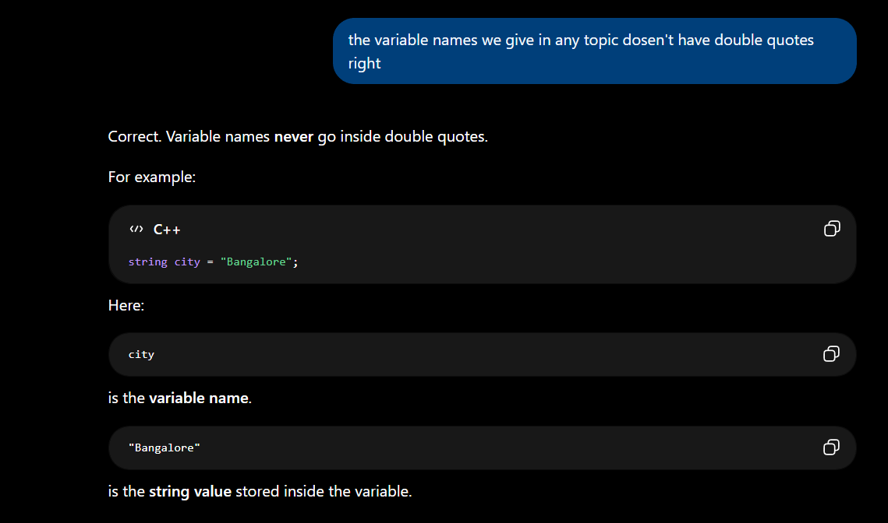

<iostream> - Rules. It defines input and output

main() - it is a function from where compiler starts reading the code. it is the Entry point of the code.

int main() - main() has to return something as output and it always returns int (integer type)

invalid in C++ (only int main is allowed)
int main() { } ✔
float main() { } ❌
double main() { } ❌
char main() { } ❌
bool main() { } ❌

void main() - a function which can do something but not need to return

using namesapce std; - it is a shortcut as we don't want to write std:: always

{} - beginning and end of main fuction or the main code which will get compiled

return 0; - tells the compiler / OS I have done writing the code and it is the end of it

endl; - executes the 1st code and takes 2nd code in new line. **NEW LINE**

---

strings are written in double quotes " "

int main() {  
 int num = 10; num is a **variable** and we can write anything like int BC = 10; and it will retuen 10 as integer
}

int main() {
int anyvariablename = 10;
cout << anyvariablename; // output will be 10
return 0;
}

**Integer-**

Integer range-> 10^-9 to 10^9

int main() { // int main() {  
 int numInt = 10; int numInt = 10;
cout << "Integer is: " << numInt << endl; cout << "Integer is: " << "numInt" << endl;
return 0; return 0;  
} } // no double quotes in variable name

Output- Integer is: 10 Output- Integer is: numInt

---

**Long-**

Long range-> 10^-12 to 10^12

#include <iostream>
using namespace std;

int main() {
int numInt = 10;
cout << numInt << endl;

    long numLong = 1000000000;
    cout << numLong;
    return 0;

}

Output-
10
1000000000

cout << INT_MAX << endl;
cout << LONG_MAX << endl;
cout << LLONG_MAX << endl;
(after including <climits>)

**LONG LONG-**

range of long long -> 10^-18 to 10^18

int main() {
int numInt = 1000000000;
cout << numInt <<endl;

    long long numLong = 1000000000000000000;
    cout << numLong;
    return 0;

}

------------------------------------------------------------------------------------------------------------------------------------------------------------------

**float & double-**

float store decimal points like 10.7
Range of float -> we can store upto 7 decimal places
Range of double float -> upto 15 decimal places

int main() {
float numFloat = 8.7;
cout << numFloat;
return 0;
}

Output- 8.7

----------------------------------------------------------------------------------------------------------------------------------------------------------------------

**char-**

char stores a single letter or symbol like a single letter of "a" or "$" or "Z"

int main() {
char ch = 'a';
cout << ch;
return 0;
}

Output- a

int main() {
char ch = 'a';
cout << "Character :" << ch << endl;
return 0;
}

Output- Character : a

-------------------------------------------------------------------------------------------------------------------------------------------------------------------

**string-**

string is a class under std and its not a data type and it stores collection of characters

#include <iostream>
using namespace namespace std;

int main() {
string str = "Sarbesh can do it!";
cout << str;

    return 0;

}

Output- Sarbesh can do it!

----------------------------------------------------------------------------------------------------------------------------------------------------------

**bool**

boolean stores only true & false
bool

----------------------------------------------------------------------------------------------------------------------------------------------------------------

Combining-

int main() {
int age = 25;
float height = 5.9;
char grade = 'A';
bool isStudent = true;
string name = "Rahul";
return 0;
}

-----------------------------------------------------------------------------------------------------------------------------------------------------------------

cin reads only one word . stops at space, newline, tab

getline() reads the entire line including spaces

char reads only first letter

-------------------------------------------------------------------------------------------------------------------------------------------------------------------------

**Input/Output-**

output -- ask user to put value int main()
input -- store it int num1, num2; // one data type then multiple vriables
output operations -- show it as result

**tuf eg code-**
int main() {

    int age;

    // Output: Ask user a question
    cout << "Enter your age: ";

    // Input: Read what user types and store in 'age'
    cin >> age;

    // Output: Show the result
    cout << "Your age is: " << age;

    return 0;

}

**Dynamic input code-**

int main() {

    int num1, num2, num3, num4;                     // we are taking 4 variables here

                                                    // cout << "Enter 4 numbers: " << "\n";

    cin >> num1 >> num2 >> num3 >> num4;

    cout << num1 + num2 << endl;
    cout << num3 + num4;

    return 0;

}

**input-output4-** (taking 2 variables bdate & num)

int main() {

int bdate, num;

cin >> bdate;
cin >> num; // alternatively we can write cin >> bdate >> num;

cout << "The date of birth is :" << bdate << endl;
cout << "The number is :" << num;

    return 0;

}

**input-output5-** (again taking 2 variables but asking user output first)

int main() {

int bdate; // Alter int bdate, num;
int num;

cout << "Enter your DoB : ";
cin >> bdate;

cout << "Enter a number : ";
cin >> num;

cout << "The DoB is : " << bdate << endl;
cout << "The number is : " << num;

    return 0;

}

**input-output6-** (Taking 2 data types- int & float)

int main() {

int bdate; float num;

cout << "Enter your DoB : "; cin >> bdate;

cout << "Enter a number : "; cin >> num;

cout << "The DoB is : " << bdate << endl << "The number is : " << num;

    return 0;

}

/\* Input-
Enter your DoB : 22
Enter a number : 7.85

Output-
The DoB is : 22
The number is : 7.85

// to show we dont hv to write so many lines
\*/

---------------------------------------------------------------------------------------------------------------------------------------------------------------------

**if/else-**

if is a conditional statement
if()

and we close braces {} when we start if and end it

if(...) it is true or the conditions are met then everything written in the curly braces will be performed.

a condition is expressed in **true** or **false**
10 > 5 → true
10 < 5 → false
a == b → true/false

**if(condition)**

**Struct of if-**
if (....) {
}

**else-**
if the previous condition was false do this instead
else don't have any condition or logic

think of this as-
if (rain)
take umbrella
else
don't take umbrella

we use **else if** when there are **multiple conditions**

Marks >= 90 → Grade A
Marks >= 75 → Grade B
Marks >= 50 → Grade C
Otherwise → Fail

The compiler checks from top to bottom.
The first true condition wins.
After finding a true condition, it skips the rest.

if(x > 90) if(x > 90)
if(x > 75) else if(x > 75) --> They are not same as if's all conditions are checked and with else if checking stops when the 1st true condition arrives
if(x > 50) else if(x > 50)

if(conditionals) {
operation if condition is true and checks all the next if's condition
}

else {
just operation when if is false
}

else if (conditions) {
operation and stops at 1st true condition
}

**if-else-tuff code-**

int main() {
int money = 500;

    cout << "how much balance you have :";
    cin >> money;

if (money >= 1000) {
cout << "I will buy a pizza";
}

    else {
        cout << "I will buy a burger";
    }

    return 0;

}

**if-else code-**

int main() {

int age;
cout << "Enter your age: ";
cin >> age;

if (age >= 18) {
cout << "Adult"; // if we don't use else, then the program will print "Adult" for ages 18 and above, but it will not print anything for ages below 18
}

else {
cout << "Teen";
}
return 0;
}

**if-else-multiple-**

// Given an age,
// if the age >= 18, print "Adult"
// if the age < 18 and >= 10, print "Teen"
// if the age < 10, print "Child"

int main() {

int age;
cout << "enter your age: ";
cin >> age;

if (age >= 18) {
cout << "Adult";
}

else if (age < 18 && age >= 10) { // in and && operator both the condition should be true to fullfill the overaall condition
cout << "Teen"; // or else if we want one condition can be true we will use OR || operator
}

else if (age < 10) {
cout << "Child";
}

    return 0;

}

**if-else-multiple2-**

int marks;
cout << "Enter marks :";
cin >> marks;

if (marks >= 90) {
cout << "Grade A";
}

else if (marks >= 70 && marks < 90) {
cout << "Grade B";
}

else if (marks >= 50 && marks < 70) {
cout << "Grade C";
}

else if (marks >= 35 && marks < 50) {
cout << "Grade D";
}

else {
cout << "Fail";
}

return 0;

---

**switch case-**

it is another way of writing if statement but what can be possible if-else conditions

imagine we have exact values like ( 1 = Monday or 90 = Grade A )
and not marks > 90 then we need if-else
it works best when exact value matches but we need **breaks** or else program keeps flowing downwards until switch ends and that's called **Fall-through**
break; means exit the switch immediately

default means like else in if-else chain
if no case mathces- default: runs

switch() {

}

switch(variable name) { // switch(day) {}  
 case 1:
break;

case 2:
break;
}

**switch-case code-**

int main() {

int day;
cout << "Enter the day: ";
cin >> day;

switch(day) {

    case 1:
    cout << "Monday";
    break;

    case 2:
    cout << "Tuesday";
    break;

    case 3:
    cout << "Wednesday";
    break;

    case 4:
    cout << "Thursday";
    break;

    case 5:
    cout << "Friday";
    break;

    case 6:
    cout << "weekend";
    break;

    case 7:
    cout << "weekend";
    break;

    default:
    cout<< "Invalid";

}

    return 0;

}


--------------------------------------------------------------------------------------------------------------------------------------------------------------------------------


**Arrays-**

An Array is an multiple values of the same type stored in contiguous memory locations.
Arrays are containers where we can keep similar data types.

For an array of size 5-
Index: 0 1 2 3 4
Value: 10 20 30 40 50

First index = 0
Last index = n - 1

For size 5 , Last index = 4
For size 10 , Last index = 9

Accessing elements-
arr[0]
arr[2]
arr[4]

## Traversal-
for(i = 0; i < n; i++)
Think that, I am visiting every element exactly once

### Common mistake-

Suppose size is 5
arr[0]
arr[1]
arr[2]                 **arr[] -> This is Index**
arr[3]
arr[4]
This is Valid

arr[5]
This is Invalid. This is called **Out of bounds access**


num[0] -> 0 positions away from start
num[1] -> 1 position away from start
num[2] -> 2 positions away from start


First index  =  0
Last index   = size - 1
Number of elements = size


### For any array:
first index = 0
last index  = size - 1


### A concept to talk-

if we need different numbers or different variable sunder same data type what's the point of writing int num1, num2, num3...
when we write int num;  - it picks up a memeory location & whatever value u assigns it get stored in that memory
data type  variable [how many elements that array have] - 
int num[5];        - it figures out 1st,2nd,3rd,4th,5th memory address & binds them & keep it contagious - that's 5 contagious memory location 
- every memory location can store an integer & we hv 5 memory locations & all of 5 locations can store integer 

```
int main() {
int num = 5;
cout << &num;      // when we type &num it shows where the 5 is stored in memory in this case it is 0x61ff0c
return 0;          // Output- 0x61ff0c        - this is memory address where 5 is stored 
}
```

### How we declare arrays (structure)-
data type  variable [how many elements that array have] - 
int num[5];        - it figures out 1st,2nd,3rd,4th,5th memory address & binds them & keep it contagious - that's 5 contagious memory location 
- every memory location can store an integer & we hv 5 memory locations & all of 5 locations can store integer 


&  -> shows the memory location 

let's say datatype of int num = 5;
cout << &num;     -> it shows the memory location of variable num stored as integer data type 


## Arrays-print5-nos code- 

Problem Statement- Take 5 numbers from us and print them and store it in an Array 

```
int main() { 
  int num[5];

  cout << "Enter 5 numbers: ";

  for(int i = 0; i <= 4; i++) {
    cin >> num[i];                                        
    cout << num[i] << "\n";

  }
 return 0;

 }
 ```

 ### note- 
 Because arrays start from index 0
So 0 1 2 3 4 
Total = 5 elements 

Important Concept-

int num[5];    // Creates 5 boxes 
| Index | Value |
| ----- | ----- |
| 0     | ?     |
| 1     | ?     |
| 2     | ?     |
| 3     | ?     |
| 4     | ?     |

When user enter values:
it get stored inside--   cin >> num[i];        // user input gets stored in those boxes


--------------------------------------------------------------------------------------------------------------------------------------------------------------------------------


**Strings-**

we use string instead of char because char allows single letter or single symbols and string allows multiple letters 
char -> Stores one character
string -> stores a sequece of characters 

- Strings are basically  **Arrays of characters + extra functionality**

Array:
[10,20,30,40]

String:
['H','e','l','l','o']

### Both have- 
Indexing
Traversal
Length
Access by position


# cin vs getline()
cin stops reading after space 

Suppose, user enters Sarbesh Mallick as input 

Using Cin ->
```
 string name;
cin >> name;
```

Output stored in name: Sarbesh 

not entire name- Sarbesh Mallick because 
**Because cin stops reading when it encounters:**
1. space
2. tab
3. newline

So, Sarbesh Mallick
        ^
      stop here   , Mallick remains in the input buffer 


### Using getline()
```
string name;
getline(cin, name);
```
Output stored in name: Sarbesh Mallick                (full name) 


Quick Rule-
cin       -> reads one word
getline() -> reads the entire line


### We will learn string indexing 

string name = "Sarbesh";

Character:  S  a  r  b  e  s  h
Index:      0  1  2  3  4  5  6

name[0] -> S   (1st character)
name[6] -> h   (last character)


What if -> name[7] ?

for Sarbesh
- Length = 7
- Last Index = 6

So, name[7] is out of bounds and should be considered invalid access.


This is the exact same rule you learned for arrays:

Length = n
Valid indices = 0 to n-1

For "Sarbesh":

Length = 7
Valid indices = 0 to 6


### Traversing- 
It means Visit every element one by one.

For an array of [10, 20, 30, 40, 50]
Traversal means:-
Visit 10
Visit 20
Visit 30
Visit 40
Visit 50

For a string: Sarbesh 
traversal means:-
Visit 'S'
Visit 'a'
Visit 'r'
Visit 'b'
Visit 'e'
Visit 's'
Visit 'h'

when we write for(int i = 0; i < name.length(); i++)
Think of i as a finger moving across the string.       i=0 for S then i=1 for a then i=2 for r and so on.....      The loop variable is literally walking through the string.


Why do we traverse?
- Because we usually want to do something with each character.

For Array:- 10 20 30 40 50
Traversal:-
arr[0]
arr[1]
arr[2]
arr[3]
arr[4]

For String:- Sarbesh
Traversal:-
name[0]
name[1]
name[2]
name[3]
name[4]
name[5]
name[6]

### The only difference is:- 
Array -> elements are integers
String -> elements are characters


### if we have to find length-

vairable name.lenth()  
Eg:- cout << fullName.length();

Length counts every character including spaces 
For, Sarbesh Mallick:-
S a r b e s h     -> 7
(space)           -> 1
M a l l i c k     -> 7
Total:- 7 + 1 + 7 = 15

So, fullName.length() returns 15 

fullName.length()  is same as fullName.size()   and for string it does the same thing.


### Revise:-

For, Sarbesh Mallick
Length -> 15
Last Index -> 14               (Last Index = Length - 1)


### string-tuf-modified code-
```
// Probelem Statement- Store 2 strings and print it and show its length and also find the index of 3rd element 


#include <iostream>
using namespace std;

int main() {

  string firstname = "Sarbesh"; 
  string lastname = "Mallick";

  string fullname = firstname + " " + lastname;

  cout << "My fullname is: " << fullname << endl;

  cout << fullname.length() << endl;

  cout << fullname[3];
  
    
    return 0;
}
```

Output-
My fullname is: Sarbesh Mallick
15
b


### Some clarification->

- Image->



For example:
string city = "Bangalore";

Here:
city is the variable name.
"Bangalore" is the string value stored inside the variable.

Think of it like a labeled box:
Variable Name: city
Value: Bangalore

but numbers like integers dosen't need " "


int age = 22;
string name = "Sarbesh";
char grade = 'A';
Notice:
age      -> variable name  
name     -> variable name
grade    -> variable name

like in,   
string city = "Bangalore";
city is varibale and bangalore is string literal 

Single Quotes means one character ' '


### String-modified-dynamic code-   (user will input its name)

```
int main() {

  string firstname, lastname, fullname;

  cout << "Write your firstname: "; 
  cin >> firstname;                         // getline(cin, firstname);     -  we can write also this to store middlename like Sarbesh Kumar as cin ends after space

  cout << "Write your last name: ";
  cin >> lastname;

  fullname = firstname + " " + lastname;

  cout << "My fullname is: " << fullname << endl;

  cout << "Lenght of the first name is: " << firstname.length() << endl;
  cout << "Lenght of the fullname is: " << fullname.length();  

return 0;
}
```


## Common Mistakes- 

One thing to be careful about

If there was a previous cin before the getline(), then you may run into the famous:
getline() gets skipped
problem because cin leaves a newline (\n) in the input buffer.

Example:
cin >> age;
getline(cin, firstname);   // may get skipped

In such cases, you'd use:
cin.ignore();
before getline().


for my current input as getline is first there is no problem 


### getline-multiple code- 
```
int main() {

  string str1; 
  string str2;

  cout << "just hit random: ";
  getline(cin, str1);

  cout << "hit amazing ";
  getline(cin, str2);

  cout << "Life is Enjoy " << str1 << endl;
  cout << "Hit is Enjoy " << str2;
    
    return 0;
}
```

getline(cin, ?);       -   // ? is the varibale 


---------------------------------------------------------------------------------------------------------------------------------------------------------------------------


**Functions-**

