<iostream> - Rules. It defines input and output

main() - it is a function from where compiler starts reading the code. it is the Entry point of the code.

int main() - main() has to return something as output and it always returns int (integer type)

invalid in C++ (only int main is allowed)
int main() { } ✔
float main() { } ❌
double main() { } ❌
char main() { } ❌
bool main() { } ❌

void main() - a function which can do something but not need to return

using namesapce std; - it is a shortcut as we don't want to write std:: always

{} - beginning and end of main fuction or the main code which will get compiled

return 0; - tells the compiler / OS I have done writing the code and it is the end of it

endl; - executes the 1st code and takes 2nd code in new line. **NEW LINE**


--------------------------------------------------------------------------------------------------------------------------------------------------------------------------


strings are written in double quotes " "

int main() {  
 int num = 10; num is a **variable** and we can write anything like int BC = 10; and it will retuen 10 as integer
}

int main() {
int anyvariablename = 10;
cout << anyvariablename; // output will be 10
return 0;
}

---------------------------------------------------------------------------------------------------------------------------------------------------------------------------


**Integer-**

Integer range-> 10^-9 to 10^9

int main() {   
 int numInt = 10;                                                         // no double quotes in variable name
cout << "Integer is: " << numInt << endl; 
return 0; 
}                                                                                             

Output- Integer is: 10 

---------------------------------------------------------------------------------------------------------------------------------------------------------------------------

**Long-**

Long range-> 10^-12 to 10^12

#include <iostream>
using namespace std;

int main() {
int numInt = 10;
cout << numInt << endl;

    long numLong = 1000000000;
    cout << numLong;
    return 0;

}

Output-
10
1000000000

cout << INT_MAX << endl;
cout << LONG_MAX << endl;
cout << LLONG_MAX << endl;
(after including <climits>)


## Code for max- 
```
#include <iostream>
#include <climits> 

using namespace std;

int main() {

    cout << INT_MAX << endl;
    cout << LONG_MAX << endl;
    cout << LLONG_MAX << endl;

    return 0;
}
```
Output-> 
2147483647
2147483647
9223372036854775807


### Fun Fact-
1. its better to use '\n' compared to "\n" although the difference is tiny 
2. when we cout << "Hello";  the text is not printed immediately on terminal, instead it goes on temporary memory area called **Buffer**
3. Flushing means take everything currently sitting in the buffer and send it to the output device right now.
    cout << "Hello";
    cout.flush();  
4. endl is equivalent to print a newline & flushing the buffer 
5. although flush or endl is better but it is not free, mostly '\n' is used
6. 
7. buffer is like a truck carrying packages 


**LONG LONG-**

range of long long -> 10^-18 to 10^18

int main() {
int numInt = 1000000000;
cout << numInt <<endl;

    long long numLong = 1000000000000000000;
    cout << numLong;
    return 0;

}

1. Number data Types->                    int , long , long long 
2. Decimal number data types->            float , double 
3. single alphabet/letter/symbol->        char
4. multiple letters->                     string                      (string is a class under std & not data tyoe, Eg- "Sarbesh can do it!")
5. true/false->                           bool

------------------------------------------------------------------------------------------------------------------------------------------------------------------

**float & double-**

float store decimal points like 10.7
Range of float -> we can store upto 7 decimal places
Range of double float -> upto 15 decimal places

int main() {
float numFloat = 8.7;
cout << numFloat;
return 0;
}

Output- 8.7

----------------------------------------------------------------------------------------------------------------------------------------------------------------------

**char-**

char stores a single letter or symbol like a single letter of "a" or "$" or "Z"

int main() {
char ch = 'a';
cout << ch;
return 0;
}

Output- a


int main() {
char ch = 'a';
cout << "Character :" << ch << endl;
return 0;
}

Output- Character : a

-------------------------------------------------------------------------------------------------------------------------------------------------------------------

**string-**

string is a class under std and its not a data type and it stores collection of characters

#include <iostream>
using namespace namespace std;

int main() {
string str = "Sarbesh can do it!";
cout << str;

    return 0;

}

Output- Sarbesh can do it!

----------------------------------------------------------------------------------------------------------------------------------------------------------

**bool**

boolean stores only true & false
bool

----------------------------------------------------------------------------------------------------------------------------------------------------------------

Combining-

int main() {
int age = 25;
float height = 5.9;
char grade = 'A';
bool isStudent = true;
string name = "Rahul";
return 0;
}

-----------------------------------------------------------------------------------------------------------------------------------------------------------------

cin reads only one word . stops at space, newline, tab

getline() reads the entire line including spaces

char reads only first letter

-------------------------------------------------------------------------------------------------------------------------------------------------------------------------


2. **Input/Output-**

output -- ask user to put value int main()
input -- store it int num1, num2; // one data type then multiple variables
output operations -- show it as result


**tuf eg code-**
```
int main() {

    int age;

    // Output: Ask user a question
    cout << "Enter your age: ";

    // Input: Read what user types and store in 'age'
    cin >> age;

    // Output: Show the result
    cout << "Your age is: " << age;

    return 0;

}
```


**Dynamic input code-**
```
int main() {

    int num1, num2, num3, num4;                     // we are taking 4 variables here

                                                    // cout << "Enter 4 numbers: " << "\n";

    cin >> num1 >> num2 >> num3 >> num4;

    cout << num1 + num2 << endl;
    cout << num3 + num4;

    return 0;

}
```


**input-output4-** (taking 2 variables i.e bdate & num)
```
int main() {

int bdate, num;

cin >> bdate;
cin >> num;                                                 // alternatively we can write cin >> bdate >> num;

cout << "The date of birth is :" << bdate << endl;
cout << "The number is :" << num;

    return 0;

}
```


**input-output5-** (again taking 2 variables but asking user output first)
```
int main() {

int bdate;                           // Alter int bdate, num;
int num;

cout << "Enter your DoB : ";
cin >> bdate;

cout << "Enter a number : ";
cin >> num;

cout << "The DoB is : " << bdate << endl;
cout << "The number is : " << num;

    return 0;

}
```


**input-output6-** (Taking 2 data types- int & float)
```
int main() {

int bdate; float num;

cout << "Enter your DoB : "; cin >> bdate;

cout << "Enter a number : "; cin >> num;

cout << "The DoB is : " << bdate << endl << "The number is : " << num;

    return 0;
}
```

/\* Input-
Enter your DoB : 22
Enter a number : 7.85

Output-
The DoB is : 22
The number is : 7.85

// to show we dont hv to write so many lines
\*/


---------------------------------------------------------------------------------------------------------------------------------------------------------------------


3. **if/else-**

if is a conditional statement
if()

and we close braces {} when we start if and end it

if(...) it is true or the conditions are met then everything written in the curly braces will be performed.

a condition is expressed in **true** or **false**
10 > 5 → true
10 < 5 → false
a == b → true/false


**if(condition)**

**Struct of if-**
if (....) {
}


if(conditions) {
    if conditions are true then do logic/operations/print
}


**else-**
if the previous condition was false do this instead
else don't have any condition or logic

think of this as-
if (rain)
take umbrella
else
don't take umbrella


we use **else if** when there are **multiple conditions**

Marks >= 90 → Grade A
Marks >= 75 → Grade B
Marks >= 50 → Grade C
Otherwise → Fail

The compiler checks from top to bottom.
The first true condition wins.
After finding a true condition, it skips the rest.

if(x > 90) if(x > 90)
if(x > 75) else if(x > 75) --> They are not same as if's all conditions are checked and with else if checking stops when the 1st true condition arrives
if(x > 50) else if(x > 50)


**Structure-**
if(conditionals) {
operation if condition is true and checks all the next if's condition
}

else {
just operation when if is false
}

else if (conditions) {
operation and stops at 1st true condition
}


**if & else-tuff code-**

Problem statement- if the user has >1000 then cout buy a pizza or else if it is less then cout I will buy a burger 
```
int main() {
int money = 500;

    cout << "how much balance you have :";
    cin >> money;

if (money >= 1000) {
   cout << "I will buy a pizza";
}

else {
   cout << "I will buy a burger";
 }

    return 0;

}
```


**if & else code-**

Problem Statement- Given an age, print adult >= 18, or print "Teen"
```
int main() {

int age;
cout << "Enter your age: ";
cin >> age;

if (age >= 18) {
cout << "Adult";                // if we don't use else, then the program will print "Adult" for ages 18 and above, but it will not print anything for ages below 18
}

else {
cout << "Teen";
}
return 0;
}
```


**if-else-multiple-**

Problem Statement- 
// Given an age,
// if the age >= 18, print "Adult"
// if the age < 18 and >= 10, print "Teen"
// if the age < 10, print "Child"

```
int main() {

int age;
cout << "enter your age: ";
cin >> age;

if (age >= 18) {
cout << "Adult";
}

else if (age < 18 && age >= 10) {                           // in "and" "&&" operator both the condition should be true to fullfill the overall condition
cout << "Teen";                                             // or else if we want one condition can be true we will use OR " || "  operator
}

else if (age < 10) {
cout << "Child";
}

    return 0;

}
```


**if-else-multiple2-**

Problem statement-
Given the marks of a student, tell us the grade he is getting following the below rules 
 Grade A- (>=90)
 grade B- (>=70 and <90)
 Grade C- (>=50 and <70)
 Grade D- (>=35 and < 50)
 Fail-     (< 35)

```
int marks;
cout << "Enter marks :";
cin >> marks;

if (marks >= 90) {
cout << "Grade A";
}

else if (marks >= 70 && marks < 90) {
cout << "Grade B";
}

else if (marks >= 50 && marks < 70) {
cout << "Grade C";
}

else if (marks >= 35 && marks < 50) {
cout << "Grade D";
}

else {
cout << "Fail";
}

return 0;
```

----------------------------------------------------------------------------------------------------------


**switch case-**

it is another way of writing if statement but what can be possible if-else conditions

imagine we have exact values like ( 1 = Monday or 90 = Grade A )
and not marks > 90 then we need if-else
it works best when exact value matches but we need **breaks** or else program keeps flowing downwards until switch ends and that's called **Fall-through**
break; means exit the switch immediately

default means like else in if-else chain
if no case mathces- default: runs


switch() {

}


switch(variable name) {                                                // switch(day) {}  
 case 1:
break;

case 2:
break;
}


**switch-case code-**
```
int main() {

int day;
cout << "Enter the day: ";
cin >> day;

switch(day) {

    case 1:
    cout << "Monday";
    break;

    case 2:
    cout << "Tuesday";
    break;

    case 3:
    cout << "Wednesday";
    break;

    case 4:
    cout << "Thursday";
    break;

    case 5:
    cout << "Friday";
    break;

    case 6:
    cout << "weekend";
    break;

    case 7:
    cout << "weekend";
    break;

    default:
    cout<< "Invalid";

}

    return 0;

}
```


## Nested if-else->

What is Nested if-else?
A nested if-else means:
👉 an if statement inside another if statement.
So first outer condition checks, then inner condition checks.
Example:
if (condition1) {

    if (condition2) {
        // code
    }

}

Important Learning
Outer if  - Narrows down possibilities.
Inner if   -  Does more detailed checking.
That is exactly how nested conditions work.


### Nested-if-refined code-

Problem statement-
You are given three integers a, b and c
print which of these integers are largest 
if two or more integers are equal and are the largest, print any of them
the program should indicate that as well , user will input the 3 integers at runtime

```
int main() {

  int a, b, c;
  cout << "Enter your 3 numbers: ";
  cin >> a >> b >> c;


  if (a >= b) {

    if(a >= c){

      if (a == b || a == c) {
        cout << "largest number is: " << a << " & There's a tie" << endl;
      }

      else {
        cout << "largest number is: " << a << endl;
      }
    }

      else {
        cout << "largest number is: " << c << endl;
      }

  }


  else if ( b >= c) {
      
    if ( b == c) {
      cout << "largest number is: " << b << " & There's a tie" << endl;
    }

    else {
      cout << "largest number is: " << b << endl;
    }

  }


  else {
    cout << "largest number is: " << c << endl;
  }

  return 0;
  }
```


### Nested-tuf code-

Problem statement- 
You are given three integers a, b and c
print which of these integers are largest 
if two or more integers are equal and are the largest, print any of them
the program should indicate that as well
the 3 integers are 36 56 78

```
int main() {

  int a = 36;
  int b = 56;
  int c =78;

  if (a >= b) {

    if (a >= c) {
      cout << "Largest is a";
    }
    else {
      cout << "Largest is c";
    }
  }

  else if (b >= c) {
    cout << "Largest is b";
  } 

  else {
    cout << "Largest is c";
  }   


    return 0;
}
```

- So first outer condition checks, then inner condition checks.


**Visual Structure-**

if (a >= b)

    if (a >= c)
        a largest
    else
        c largest

else

    if (b >= c)
        b largest
    else
        c largest

This is the core nested if-else pattern.


**Cleaner code with no ties-**

if (a >= b) {

    if (a >= c)
        cout << a;
    else
        cout << c;

}
else {

    if (b >= c)
        cout << b;
    else
        cout << c;
}


## Important Concept- 

'='  and  '==' both are different 

= is an assignment operator,  int a = 10;  meaning store value 10 in variable a 

== is an equality operator, it checks whether two values are equal or not,   if (a == 10) means check if a = 10 or not 


------------------------------------------------------------------------------------------------------------------------------------------------------------------------


4. **Loops-**

- when certain no. of things are repeated use LOOPS 
- first one is initializer, 2nd one is condition or break statement, third one is increment/decrement
  

## for-loop code-

Problem Statement- take input of 10 numbers and print it   OR   Print all the numbers from 1 to 10 

here we can use Loops 
instead of writing 10 nos 

if we are not writing loops then-
int main() {
int num1, num2, num3, num4...num10;
cout << "enter no";
cin >> num1 >> num2 >> ...num10;
}

```
int main() {

  for (int i = 1; i <= 10; i++) {
    cout << i << endl;
  }

    
    return 0;
}
```
Output- 1 
        2
        3
        4
        ..
        10 


### Things to remember- 

for (int i = 1; i = i + 1)  - no condition, always checks in. This is INFINITE LOOP , prog dosen't know when to stop and keep revolving around for 
  & will never reach last condition that is return 0;

for (int i = 1; i<=2;)   - Again Infinite loop as I failed to give increment then aslo it will not stop because i will always be 1 and 2nd condition is always be true 

for (int i = 1;true;i++;)  - Again Infinite loop 

that's why you need to give valid BREAK'S statement which gonna be false at some moment 

for(initialization; condition; update)
for(int i = 1;  i <= 10;    i++)


### Hello 5 times tuf code- 
// Problem statement- print hello 5 times using loops 

```
int main() {

  int i;
  for (int i = 1; i <= 5; i++) {
    cout << "Hello" << endl;
  }
    
    return 0;
}
```


### for-loop-odd 1 to 20 code- 

Problem Statement- Print odd numbers from 1 to 20

```
int main() {

  for (int i = 1; i <= 20; i = i+2) {
    cout << i << endl;
  }
    
    return 0;
}
```


### for-loop-even 1 to 20 code- 

Problem statement-  Print even numbers from 1 to 20

```
int main() {


  for (int i = 2; i <= 20; i = i+2) {
    cout << i << endl;
  }

return 0;
```


### for-loop 10 to 1 in reverse order code-
Problem stat-  print 1 to 10 numbers but in reverse order 

```
int main() {

  for( int i = 10; i >= 1; i--) {
    cout << i << endl;
  }
    
    return 0;
}
```


### for loop 10 to 1 reverse even code- 
problem stat- print all numbers from 10 to 1 in reverse order but print just even numbers

```
int main() {

  for (int i = 10; i >= 1; i = i - 2) {
    cout << i << endl;

  }
    
    return 0;
}
```


### for-loop-5multiples upto 100 code- 
Problem stat- Print all the multiples of 5 till 100 

```
int main() {

  for (int i = 5; i <= 100; i = i + 5) {
    cout << i << endl;

  }
    
 return 0;
}

```


### for-loop-5-inputs-print-sum code- 

Problem Statement- Take 5 inputs and print their sum
Problem summary - This program uses a loop to take 5 numbers one by one, keeps adding them to sum, and after all inputs are taken, prints the final total
- It's an accumulation pattern 


```
int main() {

  int num;
  int sum = 0;

  
  cout << "Enter 5 nos: ";

  for(int i = 1; i <= 5; i++) {

  cin >> num;

  sum = sum + num;

}

cout << "Sum = " << sum;

return 0;
}
```

Input: 2 4 6 8 10 
output: Sum = 30


### Breakdown- 

int sum = 0;    - we create a variable to store the local 
initially sum = 0
Loop runs 5 times    -  for(int i = 1; i <= 5; i++)
take input   -   cin >> num;
add number to the sum    -    sum = sum + num;

Example:
sum = 0
user enters 5
new sum = 0 + 5 = 5

Then:
user enters 3
new sum = 5 + 3 = 8
and so on.

instead of sum = sum + num ,   u can write-    sum += num;


### Explanation- 

- int num;    ->  Its a temporary storage box. Every time the user enters a number, it goes into num
Example:
User enters 2  → num = 2
User enters 4  → num = 4
User enters 6  → num = 6
-num keeps getting overwritten with the latest input.
  
  
- sum stores the total. We start with zero.


- for(int i = 1; i <= 5; i++) 
- this means take 5 inputs one by one just like a loop 
instead of writing manually everytime:
cin >> num;
cin >> num;
cin >> num;
cin >> num;
cin >> num;

we use a loop to repeat the same task 5 times.

- here i is just used for counting. 
- We are not printing i, and we don't really care about its value. We only use it to make the loop run 5 times.


Q. Why  is it called "Accumulation Pattern"?
A. Because a variable keeps accumulating (collecting) values over time.


- - 
int num;
int sum = 0;

num → stores each number entered by the user.
sum → stores the running total.
We initialize sum to 0 because we haven't added anything yet.

Think of sum as a bucket:
sum = 0
Every new number gets added into the bucket.


- - 
Loop
for(int i = 1; i <= 5; i++)

This loop runs 5 times.

| Iteration | i |
| --------- | - |
| 1st       | 1 |
| 2nd       | 2 |
| 3rd       | 3 |
| 4th       | 4 |
| 5th       | 5 |


- - 
Taking Input
cin >> num;     // Stores one number in num.

Example:
User enters 2
num = 2


- - 
Accumulating the Sum
sum = sum + num;

This means:  Take the old value of sum and add the new number to it.

Example if user enters:
2 4 6 8 10

| Input | Calculation | sum |
| ----- | ----------- | --- |
| 2     | 0 + 2       | 2   |
| 4     | 2 + 4       | 6   |
| 6     | 6 + 6       | 12  |
| 8     | 12 + 8      | 20  |
| 10    | 20 + 10     | 30  |

Final:   sum = 30


- - 
Output
cout << "Sum = " << sum;

Prints:
Sum = 30


- - 
Dry Run- 

Suppose input is:
1 2 3 4 5

Start:
sum = 0

Iteration 1:
num = 1
sum = 0 + 1 = 1

Iteration 2:
num = 2
sum = 1 + 2 = 3

Iteration 3:
num = 3
sum = 3 + 3 = 6

Iteration 4:
num = 4
sum = 6 + 4 = 10

Iteration 5:
num = 5
sum = 10 + 5 = 15

Output:
Sum = 15

- - 
  
### note- 

we wrote " cout << i << endl; " in every other loop programs why not here?

in earlier programs-
for(int i = 1; i <= 5; i++) {
    cout << i << endl;
}

Here the goal is Print every value of i.
So during each iteration, you immediately display i
Output:
1
2
3
4
5


But in this program:
for(int i = 1; i <= 5; i++) {
    cin >> num;
    sum = sum + num;
}

The goal is different: Add all 5 numbers together and print only the final answer.

if we write "  cout << sum << endl;  "  inside the loop we will get 
Output:
2
6
12
20
30

because sum changes after every input.

But our probelm asked for final number after all the numbers have been added 
Thats why cout << "Sum = " << sum;  is placed outside the loop 


this is what i was talking about being inside the for loop:- 
for(int i = 1; i <= 5; i++) {

  cin >> num;
  sum = sum + num;
  cout << "Sum = " << sum << endl;
 }

Enter 5 nos: 2 4 6 8 10
Sum = 2
Sum = 6
Sum = 12
Sum = 20
Sum = 30


Notice how the meaning changes based on where cout is placed:

// Inside loop
for(...)
{
    ...
    cout << sum;
}

➡️ Print after every iteration.

for(...)
{
    ...
}

cout << sum;

➡️ Print only the final result after the loop finishes.

This is one of the most important ideas in loops: statements inside the braces {} run every iteration; statements outside run only once.

A picture of when i is inside and outside the loop and i is not only used for counting 
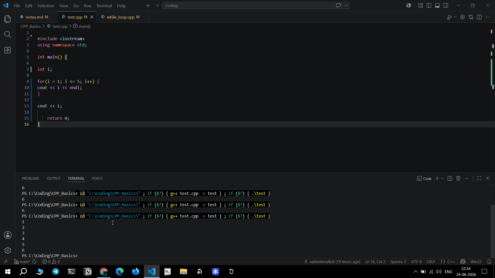
The first 1 2 3 4 5 come from inside the loop. Final 6 comes from outside the loop
i is usually used as a loop counter, but it can also be used for other purposes if needed.
Remember loop does not stop at 5. It stops when the condition becomes false. 
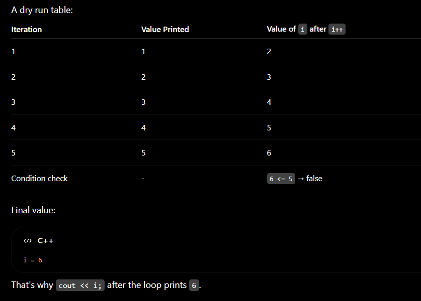


-------------------------------------------------------------------------------------------------------------------------------------------------------------------------


**While Loop-**

- Another syntatcical way of writing for loop 
- never forget to include update or increment/decrement in while loop (i++) orelse it will be an infinite loop 
  
## Basic structure of while loop- 
int i = 1;

while(i <= 5) {
    cout << i << endl;
    i++;
}


## comparison for vs while loop- 
for(int i = 1; i <= 5; i++) {
    cout << i << endl;
}


### while-loop code- 

Problem stat- Print all the multiples of 5 till 100

```
  int main() {

  int i = 5;                                           // Initializer 
  while( i <= 100) {                                   // Condition 
    cout << i << endl;                                 // Operations 

    i = i + 5;                                         // Increase 
  }

    return 0;

}
```

### Comparison of for vs while loop- 
int main() {
  for(int i = 5; i <= 100; i = i+5) {
      cout << i << endl;
  }


Whenever you write a while loop, always identify these three parts:

Initialization → Where does it start?
Condition → When should it continue?
Update → How does it move toward stopping?

If any one of these is wrong, the loop either gives wrong output or becomes an infinite loop.


A image of i inside the loop and outside the loop where 105 is printed after 100 as i called i outside the loop also and then the condition got failed 
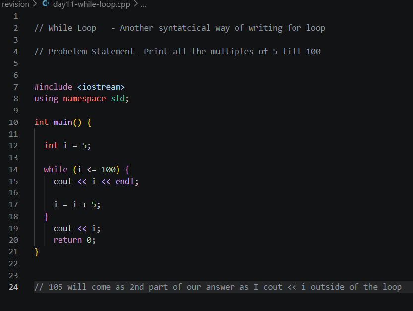


--------------------------------------------------------------------------------------------------------------------------------------------------------------------------


5. **Arrays-**

An Array is an multiple values of the same type stored in contiguous memory locations.
Arrays are containers where we can keep similar data types.

For an array of size 5-
Index: 0  1   2  3  4
Value: 10 20 30 40 50

First index = 0
Last index = n - 1


For size 5 , First index = 0, Last index = 4
For size 10, First index = 0, Last index = 9


Accessing elements-
arr[0]
arr[2]
arr[4]

arr[2] is the index position 

arr[5] = {10, 20, 30, 40, 50};              // example   
Think of an array as a row of boxes:
Index:    0     1     2     3     4
        +----+----+----+----+----+
Array:  | 10 | 20 | 30 | 40 | 50 |
        +----+----+----+----+----+

Now,
arr[0] → element at index 0 → 10
arr[2] → element at index 2 → 30
arr[4] → element at index 4 → 50
arr[5] -> dosen't exists 


int arr[5];   
- it means size of 5 -> the array that can store 5 elements 
- Valid indices = 0 to 4
So:
✅ arr[0]
✅ arr[1]
✅ arr[2]
✅ arr[3]
✅ arr[4]
❌ arr[5] (invalid, because index 5 doesn't exist)

arr[2] means Give me the element stored at index 2.


## Traversal-
for(i = 0; i < n; i++)
Think that, I am visiting every element exactly once


### Common mistake-

Suppose size is 5 ->  int arr[5]
arr[0]
arr[1]
arr[2]                 **arr[] -> This is Index**
arr[3]
arr[4]
This is Valid

arr[5]
This is Invalid. This is called **Out of bounds access**


num[0] -> 0 positions away from start
num[1] -> 1 position away from start
num[2] -> 2 positions away from start
- []    -> array initilization. int arr[] , int num[] ,  int sarbesh[] all works. 


First index  =  0
Last index   = size - 1
Number of elements = size


### For any array:
first index = 0
last index  = size - 1


### Declaring an Array:

data_type array_name[size]  =  {};

int arr[5] = {..};

There are three parts:
int arr[5];
│   │   │
│   │   └── Size
│   └────── Array name
└────────── Data type


- I can name any array name according to my choice 
int sarbesh[5];
int marks[100];
int ages[10];
int scores[20];

cout << sarbesh[4];  ->  output element of index 4 or the last element 


- Array can store any data type also & not  only int 
long population[10];
float temperature[7];
double salary[20];
char grade[5];
bool passed[50];
string names[10];     // string array 


data_type   array_name   [size]
    │            │          │
 What it stores  Its name   Capacity


  


### A concept to talk-

if we need different numbers or different variable sunder same data type what's the point of writing int num1, num2, num3...
when we write int num;  - it picks up a memeory location & whatever value u assigns it get stored in that memory
data type  variable [how many elements that array have] - 
int num[5];        - it figures out 1st,2nd,3rd,4th,5th memory address & binds them & keep it contagious - that's 5 contagious memory location 
- every memory location can store an integer & we hv 5 memory locations & all of 5 locations can store integer 

```
int main() {
int num = 5;
cout << &num;      // when we type &num it shows where the 5 is stored in memory in this case it is 0x61ff0c
return 0;          // Output- 0x61ff0c        - this is memory address where 5 is stored 
}
```


### How we declare arrays (structure)-
data type  variable [how many elements that array have] - 
int num[5];        - it figures out 1st,2nd,3rd,4th,5th memory address & binds them & keep it contagious - that's 5 contagious memory location 
- every memory location can store an integer & we hv 5 memory locations & all of 5 locations can store integer 

**A small terminology tip:**
People often get confused because of counting:

Array size = 5
Elements = 5
Indices = 0, 1, 2, 3, 4

So:
The 5th element is num[4]. ✅
num[5] is actually trying to access the 6th element, which does not exist. ❌


&  -> shows the memory location 
&  -> The & operator is called the address-of operator.

let's say datatype of int num = 5;
cout << &num;     -> it shows the memory location of variable num stored as integer data type 


### Difference- 

how int a = 10;  and   int b[] = {10};    are different 
- int a = 10 means create one box & store 10
- Create an array with one box, and store 10 in the first (and only) element.
-  Variable -> One Box , no index needed 
-  Array -> Many boxes , index needed 

**Output diff:**
cout << a;            // 10
cout << b[0];         // 10


int marks[] = {90, 85, 78};    equals to    int marks[3] = {90, 85, 78};
- Remember array size = elements 
- [] = {}
- index is -1 always 
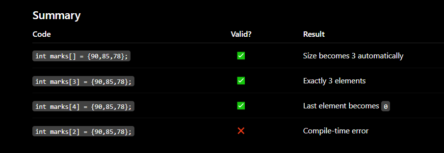
zero filling -> 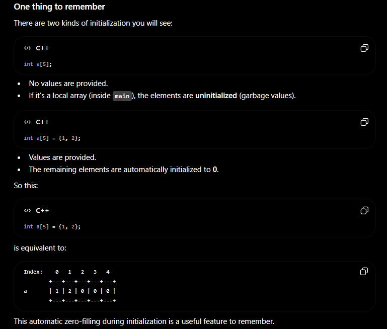
mistake to avoid -> 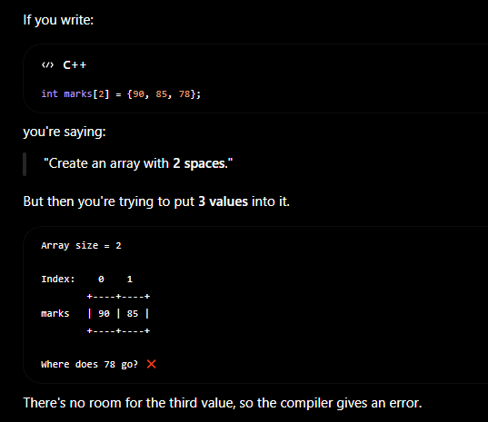
trick to remember -> 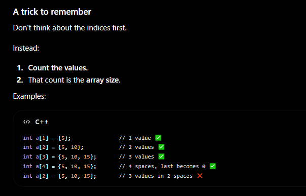


### Rule to Remember- 
For an array of size n:
for (int i = 0; i < n; i++)


## Arrays-tuf code- 

Problem statement- 
Create an array of 5 integers.
Ask the user to enter numbers.
Store each number in the correct index.
Immediately print the number that was entered

```
int main() {

    int num[5];

    cout << "Enter 5 numbers: ";

    for (int i = 0; i < 5; i++) {
      cin >> num[i];
      cout << num[i] << endl;
    }


    return 0;
}
```
Input-> 10 20 30 40 50 

Output-
10
20
30 
40
50 


## Arrays-print5-nos code- 

Problem Statement- Take 5 numbers from us and print them and store it in an Array 

```
int main() { 
  int num[5];

  cout << "Enter 5 numbers: ";

  for(int i = 0; i <= 4; i++) {
    cin >> num[i];                                        
    cout << num[i] << "\n";

  }
 return 0;

 }
 ```

 ### note- 
 Because arrays start from index 0
So 0 1 2 3 4 
Total = 5 elements 

Important Concept-

int num[5];    // Creates 5 boxes 
| Index | Value |
| ----- | ----- |
| 0     | ?     |
| 1     | ?     |
| 2     | ?     |
| 3     | ?     |
| 4     | ?     |

When user enter values:
it get stored inside--   cin >> num[i];        // user input gets stored in those boxes


### Remember-

if we want our output to come horizontally we have to use   " " 
cout << num << " "; 

for vertical output we use endl or "\n" 


--------------------------------------------------------------------------------------------------------------------------------------------------------------------------------


6. **Strings-**

we use string instead of char because char allows single letter or single symbols and string allows multiple letters 
char -> Stores one character
string -> stores a sequece of characters 

- Strings are basically  **Arrays of characters + extra functionality**

Array:
[10,20,30,40]

String:
['H','e','l','l','o']

### Both have- 
Indexing
Traversal
Length
Access by position


# cin vs getline()
cin stops reading after space 

Suppose, user enters Sarbesh Mallick as input 

Using Cin ->
```
 string name;
cin >> name;
```

Output stored in name: Sarbesh 

not entire name- Sarbesh Mallick because 
**Because cin stops reading when it encounters:**
1. space
2. tab
3. newline

So, Sarbesh Mallick
        ^
      stop here   , Mallick remains in the input buffer 


### Using getline()
```
string name;
getline(cin, name);
```
Output stored in name: Sarbesh Mallick                (full name) 


Quick Rule-
cin       -> reads one word
getline() -> reads the entire line


### We will learn string indexing 

string name = "Sarbesh";

Character:  S  a  r  b  e  s  h
Index:      0  1  2  3  4  5  6

name[0] -> S   (1st character)
name[6] -> h   (last character)


What if -> name[7] ?

for Sarbesh
- Length = 7
- Last Index = 6

So, name[7] is out of bounds and should be considered invalid access.


This is the exact same rule you learned for arrays:

Length = n
Valid indices = 0 to n-1

For "Sarbesh":

Length = 7
Valid indices = 0 to 6


### Traversing- 
It means Visit every element one by one.

For an array of [10, 20, 30, 40, 50]
Traversal means:-
Visit 10
Visit 20
Visit 30
Visit 40
Visit 50

For a string: Sarbesh 
traversal means:-
Visit 'S'
Visit 'a'
Visit 'r'
Visit 'b'
Visit 'e'
Visit 's'
Visit 'h'

when we write for(int i = 0; i < name.length(); i++)
Think of i as a finger moving across the string.       i=0 for S then i=1 for a then i=2 for r and so on.....      The loop variable is literally walking through the string.


Why do we traverse?
- Because we usually want to do something with each character.

For Array:- 10 20 30 40 50
Traversal:-
arr[0]
arr[1]
arr[2]
arr[3]
arr[4]

For String:- Sarbesh
Traversal:-
name[0]
name[1]
name[2]
name[3]
name[4]
name[5]
name[6]

### The only difference is:- 
Array -> elements are integers / numbers 
String -> elements are characters


### if we have to find length-

vairable name.lenth()  
Eg:- cout << fullName.length();

Length counts every character including spaces 
For, Sarbesh Mallick:-
S a r b e s h     -> 7
(space)           -> 1
M a l l i c k     -> 7
Total:- 7 + 1 + 7 = 15

So, fullName.length() returns 15 

fullName.length()  is same as fullName.size()   and for string it does the same thing.


### Revise:-

For, Sarbesh Mallick
Length -> 15
Last Index -> 14               (Last Index = Length - 1)


### Syntax or structure of writing length & size- 

.length()   
variablename.length(); 
variablename.size();

.lenght()  =  .size()  for strings 
but,  .size() is a general function for many c++ containers but .length() exclusively for characters 
- vector has .size()
- array has .size()
- string has both .size() and .length()


### Remember-
[]         → "Which character?" to print on every iteration 
.length()  → "How many characters?"


### Common mistakes in cin.ignore()-

1. 1st getline , 2nd getline 
2. 1st getline , 2nd cin   
3. 1st cin     , 2nd getline ❌       cin.ignore() required 


Correct way of writing 3rd condition- 
string first, last;
cin >> first;
cin.ignore();
getline(cin, last);


| Previous input | Next input  | Need `cin.ignore()`? |
| -------------- | ----------- | -------------------- |
| `getline()`    | `getline()` | ❌ No                 |
| `cin >>`       | `getline()` | ✅ Yes                |
| `getline()`    | `cin >>`    | ❌ No                 |
| `cin >>`       | `cin >>`    | ❌ No                 |

| Previous input | Next input  | Need `cin.ignore()`? |
| -------------- | ----------- | -------------------- |
| `getline()`    | `getline()` | ❌ No                 |
| `cin >>`       | `getline()` | ✅ Yes                |
| `getline()`    | `cin >>`    | ❌ No                 |
| `cin >>`       | `cin >>`    | ❌ No                 |


### string-getline-mine code-
Problem Stat- Store 2 strings and print it and show its length and also find the index of 3rd element

```
int main() {

  string firstname, lastname, fullname; 

  cout << "enter your firstname: ";
  getline (cin, firstname);

  cout << "enter your lastname: ";
  getline (cin, lastname);                       


  fullname = firstname + " " + lastname;

  cout << "your fullname is: " << fullname << endl;

  cout << "length of fullname is: " << fullname.length() << endl;

  cout << "length of firstname is: " << firstname.length() << endl;

  cout << "index of 3rd element: " << fullname[3];

    
    return 0;
}

```

Alternative->
if we want to use fullname.length() multiple times 

cout << "length of fullname is: " << fullname.length() << endl;
you could store it if you were going to use it multiple times:

int length = fullname.length();
cout << "Length = " << length;

Not necessary here, but useful in bigger programs.


### string-tuf-modified code-
```
// Probelem Statement- Store 2 strings and print it and show its length and also find the index of 3rd element 


#include <iostream>
using namespace std;

int main() {

  string firstname = "Sarbesh"; 
  string lastname = "Mallick";

  string fullname = firstname + " " + lastname;

  cout << "My fullname is: " << fullname << endl;

  cout << fullname.length() << endl;

  cout << fullname[3];
  
    
    return 0;
}
```

Output-
My fullname is: Sarbesh Mallick
15
b


### Some clarification->

- Image->


For example:
string city = "Bangalore";

Here:
city is the variable name.
"Bangalore" is the string value stored inside the variable.

Think of it like a labeled box:
Variable Name: city
Value: Bangalore

but numbers like integers dosen't need " "


int age = 22;
string name = "Sarbesh";
char grade = 'A';
Notice:
age      -> variable name  
name     -> variable name
grade    -> variable name

like in,   
string city = "Bangalore";
city is varibale and bangalore is string literal 

Single Quotes means one character ' '


### String-modified-dynamic code-   (user will input its name)

Problem stat- let the user type its fullname , store it in string, print it and show its firstname length & fullname length 

```
int main() {

  string firstname, lastname, fullname;

  cout << "Write your firstname: "; 
  cin >> firstname;                         // getline(cin, firstname);     -  we can write also this to store middlename like Sarbesh Kumar as cin ends after space

  cout << "Write your last name: ";
  cin >> lastname;

  fullname = firstname + " " + lastname;

  cout << "My fullname is: " << fullname << endl;

  cout << "Lenght of the first name is: " << firstname.length() << endl;
  cout << "Lenght of the fullname is: " << fullname.length();  

return 0;
}
```


## Common Mistakes- 

One thing to be careful about

If there was a previous cin before the getline(), then you may run into the famous:
getline() gets skipped
problem because cin leaves a newline (\n) in the input buffer.

Example:
cin >> age;
getline(cin, firstname);   // may get skipped

In such cases, you'd use:
cin.ignore();
before getline().


for my current input as getline is first there is no problem 


### getline-multiple code- 
```
int main() {

  string str1; 
  string str2;

  cout << "just hit random: ";
  getline(cin, str1);

  cout << "hit amazing ";
  getline(cin, str2);

  cout << "Life is Enjoy " << str1 << endl;
  cout << "Hit is Enjoy " << str2;
    
    return 0;
}
```

getline(cin, ?);       -   // ? is the varibale 


### Tip for the future- 

#include <limits>
cin.ignore(numeric_limits<streamsize>::max(), '\n');

- This removes everything up to the next newline, making it more robust if there are extra characters left in the input buffer.


### string using for loop code- 

Problem Statement: Given a string, print each character of the string using a for loop.
Problem Statement: Traverse a string character by character and print each character.
Problem Statement: Given a string, access and print each character using its index.
Problem Statement: Store a string and print all its characters by accessing them through their indices.

```
int main() {
    
  string str = "sarbesh mallick";

  for (int i = 0; i < str.size(); i++) {
    cout << str[i];
  }

 return 0;
}
```
output- sarbesh mallick 


### Conceptual clarity- 
str[i]   -  Give me the character stored at index i , each iteration and together it becames sarbesh 
str      -  means the entire string, not a single character. Every iteration prints sarbesh and loop runs 7 times i.e sarbeshsarbeshsarbeshsarbesh....

str[6]   - inside the loop & will print 15 times 
str[7]   - inside the loop, it will be blank becasue space btw sarbesh and mallick it is 
str outside the loop will simply print sarbesh mallick as it is 


-----------------------------------------------------------------------------------------------------------------------------------------------------------------


7. **Functions-**

Imagine you hv- 
- take 2 numbers
- Add them 
- print result 
If you need this logic 10 times, you hv to write it 10 times.
Instead, **Functions let you Write once, reuse many times**

main() - entry point of the code & the first function that the operating system calls when your program starts.


- A function is a block of code that does a specific task. We write it once and call it whenever we need it.
It's like a "helper" or a "servant". We teach the servant how to make tea once, and then just order "Make Tea" anytime.
Functions keep our code clean and reusable

int main() is the entry point of cpp code 
void main() - it is a self function where it will do something but will not return anything
void main() is a non-standard and should not be used, even though some old compilers accept it.


### Difference btw function & loop- 
- Now the function contains the logic, and the loop decides how many times to run it
- Function → What to do
  Loop → How many times to do it
- we can use loop and functions togerther 


## Code-
```
#include <iostream>
using namespace std;
void print() {
    cout << "I am a print function" << endl;
}                                                      
int main() {
    
    return 0;                                                  // It will return nothing or print nothing , for that we need to call print() after int main()
}
```


## functions code-

Problem statement- Write a C++ program to create a user-defined function print() that prints a message, and call it from the main() function.

```
#include <iostream>
using namespace std;

void print() {
    cout << "I am a print function" << endl;
}

int main() {

    cout << "Before print function call" << endl;

    print();                                                    // Whenver the function is called, its get a priority, it will be executed first & then reamining lines
                                                                
    cout << "After print function call" << endl;
    
    return 0;
}
```

**Output-**
Before print function call
I am a print function
After print function call


### Explanation-

void print() {
    cout << "I am a print function" << endl;                // This does not excute anything, it only tell compilers that there exists a function named print()
}                                                           // Its like a tool, tool exists but nobody is using it 


program always starts from int main()  and not from print()
1. so after int main the compiler reads "Before Print function call" and it prints that                        // Output-Before Print function call 
2. now it reads print();
3. when the cpu sees print();  -
   Pause main()
   Jump to print()
   Execute print()
   Come back / return
   Continue main()

4. inside print() cpu jumps here-
   void print() {
    cout << "I am a print function" << endl;                                                                   // Output- I am a print function
}

5. Functions ends as there is no explicit return 0; but as it is void it automatically returns when it reaches } 
6. CPU goes back to the exact place where print() 
7. Continue with main()  
   cout << "After print function call" << endl;                                                                      // Output- After print function call

8. Final Output-
   Before print function call
   I am a print function
   After print function call 

 When a function is called,
 program control jumps to that function.
 After the function finishes,
 control returns to the caller.


### Remember- 
void means it returns nothing, its job is only to print something or doing something 
void dosen't return values to int main() , it just does it job and shows it and exits 
like void add() prints the cout but dosen't hand anything to main()


### Remember- 
- void function er modhye sob logic , statements thkbe, I just need to call it and ota execute hbe 
- but returning function e amke return kichu krte hbe to int main() caller and shey decide krbe ki krte hbe returned value niye, shey chaile cout lrte pare ki add
  
- eg:  void add() {
        cout << 6;
        logic...
      }
      
      add();           ✔    // void function ke call krlam and it will execute whatever logic i had written inside the void add() {}
      cout << add();  ❌   // not possible 


- eg:   int add() {
        cout << 6;
        return 5;
      }
      
       add();                 // 6 will get printed, 
       cout << add();         // then 6 & 5 both will get printed 
       cout << add() + 5;     // 10 will get printed (5+5)


### Understanding-functions Code-
```
int add() {
    cout << 6 << endl;
    return 5;

}

int main() {

    cout << "Before print function call" << endl;

    cout << add() << endl;

    cout << "After print functionn call" << endl;
                                                                
    return 0;
}
```
cout << 6;     -  Show 6 on the screen
return 5;      - Give 5 back to the caller & caller will decide what do with it 


### Explanation- 
- Cpp starts from main()
- The add() function is not executed yet. Think of add() as a worker waiting for instructions.
- Execution reaches "Before print function call" and shows the same as output 
- Now, execution reaches  cout << add() << endl;
- cout dosen't print first, it pauses and jumps to see what's the value of add()
- think of it like:
  main()
   ↓
cout << add();
   ↓
  Wait...
 I need to know add()
   ↓
Go to add()

- As now we are inside 
   int add() {
   cout << 6 << endl;          // prints 6 
    return 5;                  // This does NOT print 5. It returns the value to the caller.
  } 

- now the program comes back to the   cout << add() << endl;
- the computer replaces add() with 5   so it becomes   cout << 5 << endl;   which prints 5 


### Example explanation- 

int square()
{
    return 25;
}
square();                ❌       // Nothing gets printed, Because nobody is using the returned value. The function simply returns 25, and then it's discarded.
cout << square();        ✔        // Now, 25 gets printed 


### Example to understand void & main-

**Void Function->**

void printName() {
    cout << "Sarbesh";
}
printName();                               // Call: printName();

Output: Sarbesh 
But what value came? -> Nothing cuz void means no return value 


**Returning Function->**

int getAge() {
    return 22;
}
cout << getAge();                   // Call
 
Output: 22


**Trick Question->**

Suppose-

void printName() {
    cout << "Sarbesh";
}

Can we do-    cout << printName();   ❌

Because, printName() returns nothing and cout needs a value to print 


**Mental Model-**
cout
↓
Screen

return
↓
Caller Function
- Different destinations.


### Inference-

The function istelf has no special power.
like print() dosent print automatically we have to write cout under that
so, we can name te function anything like void add()  or void hello()  and still print something by writing cout 
**the function name is just a label**

The important thing is what does the function does inside its body 


- Never write code after return as the function has already exited 
- in void function everything happens inside and main gets nothing, whatever u want do with void u do it inside the void and just call it when reqd.
- in returning functions, u do the math or whatever and give it to main and main will further do processing or just print it 
  
- void -> Includes everything under it 
- returning function -> just do basic thing and return to main caller and the main will handle the rest 

- with void whatever we do and if we print results, it just get printed and lost we cannot usally use it later in different way 


### Promise- 

- when we write returning function, by default it promises it will return something to caller.
- but when we don't return something, and only call the function that's still  okay, it executes logic inside the function but dosen't return anything. 
- but if we cout << function-name();  then it will provide a garbage value because int function-name() promised to return an integer value which it failed 
- a function task is to deliver the return value to main() caller, and main caller will decide what to do 
- a return type function will always return something except void 
  
1.  int add() {
  return 5;                              // returns an integer 
 }
  cout << add();                         // Output- 5 

2.  int age() {
    return 20;                          // returns a character.
   }

3.  double pi() {
    return 3.14;                        // returns a decimal number.
   }

4.  string name() {
    return "Sarbesh";                   // returns a string.
   }

5. char grade() {
    return 'A';                         // returns a character 
   }
 
But

6. void print() {
    cout << "Hello";                   // returns nothing 
}


### 3 Cases- 
1. 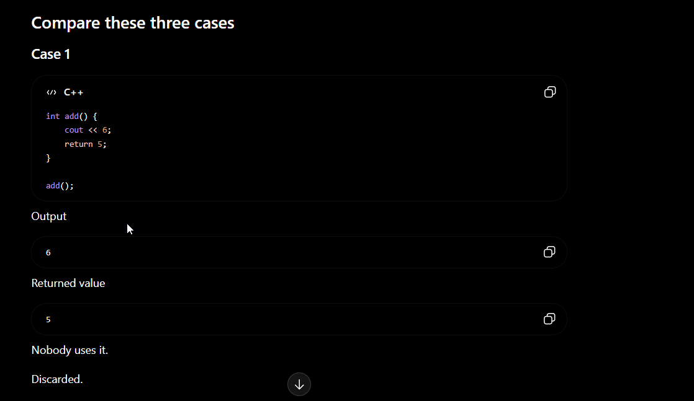
2. 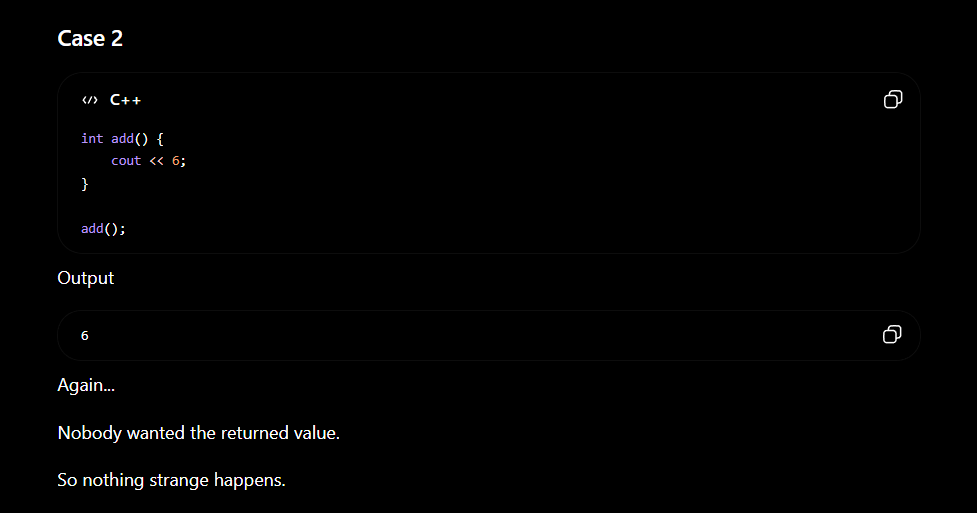
3. 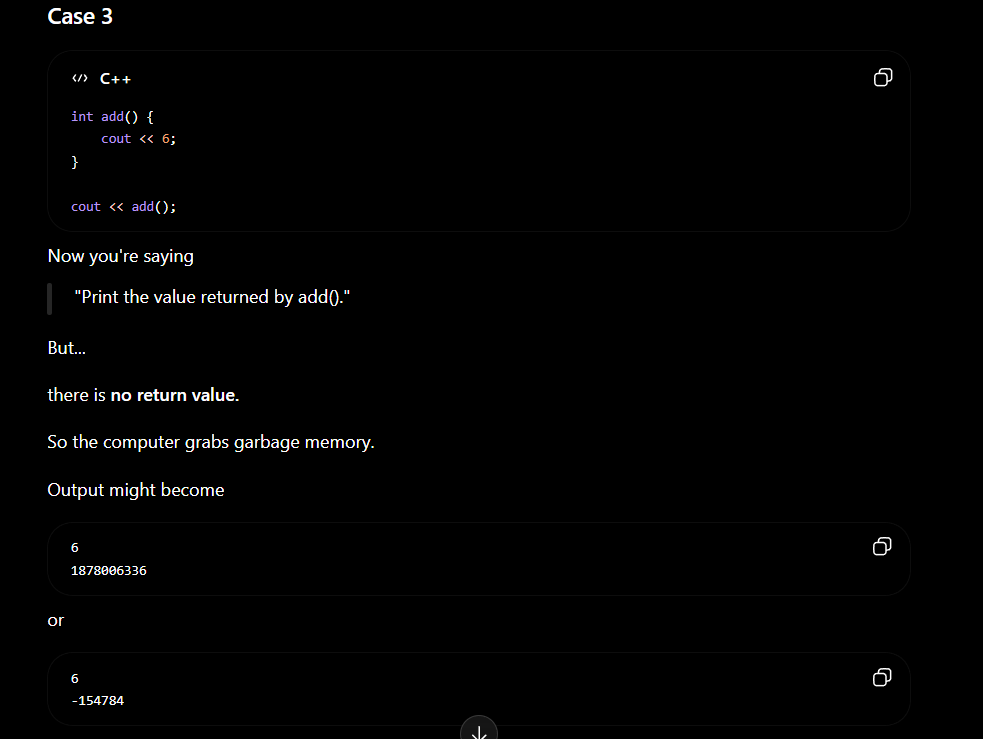

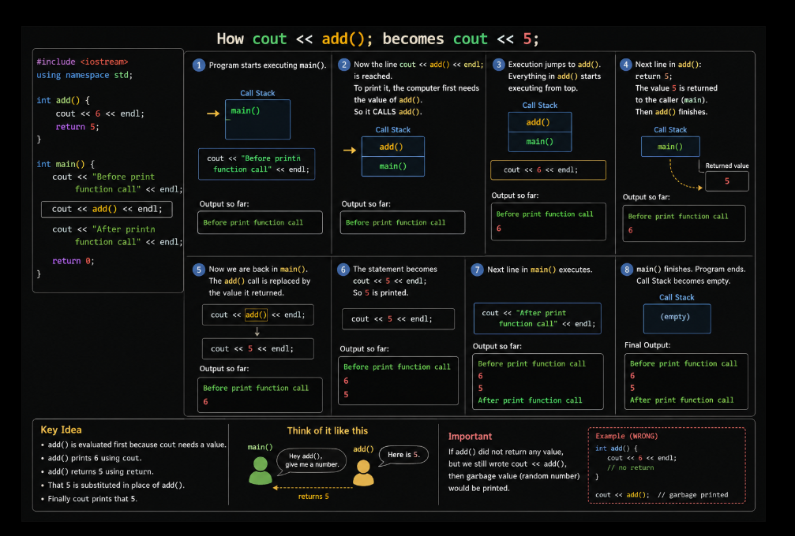


## Does only int main() expects a return?
Ans- NO 

- The code that calls a function receives its return value.
- It doesn't have to be main().
- for example- 
```
#include <iostream>
using namespace std;

int add() {
    return 5;
}

void printNumber() {
    cout << add();                      // Here, printNumber() is calling add()
}

int main() {
    printNumber();

    return 0;

}
```
Output- 5 
In this case, printNumber() receives the value 5, not main() directly.


### Let's take an example of void & return-

**My Current function with void-**

```
void twonosprint() {
    int num1, num2;
    cin >> num1 >> num2;

    cout << num1 + num2;
}
```
- Suppose user enters 10, 20 and Output will be 30 then 
- Now, 30 is printed on the screen 
- but can another part of program uses 30?   ->  NO    ->  cuz it is printed not retuned 
- twonosprint();         -  can print 30 
- twonosprint() * 10     - Can't do ❌         cuz the function returns nothing 


void function
↓
Performs an action

Returning function
↓
Produces a value

-------------------------

void function
↓
Usually performs an action
(printing, modifying data, etc.)

int function
↓
Usually computes something
and returns an answer
This isn't a strict rule, but it's a very useful beginner mental model.


- A printed value is visible to the user. A returned value is usable by the program.


## Operator Precedence (BODMAS / PEMDAS)- 

C++ follows the same order of operations as Mathematics (BODMAS/PEMDAS).

### Precedence Order
1. Parentheses `()`
2. Multiplication `*`, Division `/`, Modulus `%`
3. Addition `+`, Subtraction `-`

### Example 1

```cpp
cout << num1 + num2 * 10;
```

Input:
```
num1 = 1
num2 = 2
```

Evaluation:
```
1 + 2 * 10
= 1 + 20
= 21
```

**Output:** `21`

> Multiplication is performed before addition.


---

### Example 2

```cpp
cout << (num1 + num2) * 10;
```

Evaluation:
```
(1 + 2) * 10
= 3 * 10
= 30
```

**Output:** `30`

> Parentheses have the highest priority, so the addition is performed first.

---

### Key Takeaways

- C++ follows BODMAS/PEMDAS rules.
- Multiplication and division have higher precedence than addition and subtraction.
- Use parentheses `()` whenever you want a specific part of the expression to be evaluated first.
- > 💡 Tip: If you're ever unsure about the order of evaluation, use parentheses `()`. They make the code easier to read and prevent logical mistakes.


### Conceptual Clarity- 

> Structure of any function-
 return_type function_name(parameters)


1. void is also a return type , it just that it is a special return type where function returns nothing.
2.  every function has a return type 
   int add()      ->  returns an integer | return type = int 
   double area()  ->  returns a decimal  | return type = doule 
   void add()     -> returns nothing     | return type = void 

3. void return also have parameters like other return types-
    
  A.  **Void function without parameters-**
        void greet() {
        cout << "Hello";
       }
  Returns nothing, Takes nothing.


  B. **Void function WITH parameters-**
       void add(int a, int b) {
       cout << a + b;
     }
   
  Notice now, (int a, int b) are paramters 
  Now you call-
  add(10, 20); 
  Output- 30 


4. int function with & without parameters 
   
 A.  **No params-** 
      int getNumber() {
      return 5;
     }

No parameters, Returns an integer.


 B.  **With params-**
      int add(int a, int b) {
      return a + b;
     }

It takes both- 
✔ takes parameters
✔ returns a value


### Example- 

void add2nos(int num1, int num2)
- Now the parameter list isn't empty anymore—the function receives num1 and num2 from whoever calls it.

For example:
add2nos(10, 20);

>Here:
int num1, int num2 are parameters (they're defined in the function).
10, 20 are arguments (the actual values you pass when calling the function).


### chatgpt example of functions/void- 
```
#include <iostream>
using namespace std;

void first() {
    cout << "1";
}

int second() {
    cout << "2";
    return 3;
}

int main() {

    cout << "A";

    first();

    cout << second();

    cout << "B";

    first();

    cout << second();

    cout << "C";

    return 0;
}
```
Output - A123B123C


### Another one from chatgpt- 
```
#include <iostream>
using namespace std;

int fun() {
    cout << "A";
    return 5;
}

int main() {

    cout << fun() + fun();

    return 0;
}
```
Output- AA10 

> Why its not A5A5 
- when we write,   return 5   the function is giving 5 back to the caller. It is not displaying 5.
- Only this line prints 5 (or any returned value):
    cout << fun();
- In your program, you wrote:
    cout << fun() + fun();
- So the two returned values are added first, and then the result is printed.

> cout prints. return sends a value back.


### function-addition modified using for loop and void combined- 

Problem stat- 
Write a C++ program to create a void function that accepts
two integers and prints their sum. Use a for loop to call
the function multiple times and demonstrate code reusability all using void 

```
#include <iostream>
using namespace std;

void add2nos() {
  int num1, num2;
  cout << "Enter 2 numbers: ";
  cin >> num1 >> num2;
  cout << "The sum of 2 numbers is: " << num1 + num2 << endl;
}

int main() {

  for (int i = 1; i < 3; i++) {
    add2nos();
  }

  return 0;
}
```


### function-addition-loop-void-user-dynamic code- 

Problem stat- 
Write a C++ program to create a void function that accepts two integers and prints their sum.
Ask the user how many times the function should be executed, then use a for loop to call the function that many times. Demonstrate code reusability using a void function.

```
#include <iostream>
using namespace std;

void add2nos() {
   
  int num1, num2;
  cout << "Enter 2 numbers: ";
  cin >> num1 >> num2;
  cout << "The Sum of 2 numbers is: " << num1 + num2 << endl;
 } 


int main() {
   
  int n;
  cout << "How many times do you want to add two numbers? ";
  cin >> n;

  for (int i=0; i < n; i++) {
    add2nos();
  }

    return 0;

}
```

> Enhancements- 

instead of How many times do you want to add two numbers?
we can write:
How many times do you want to perform the addition?   OR   How many pairs of numbers do you want to add?

> What if someone enters -5 ?
Your program simply ends. It isn't wrong, but it isn't very user-friendly.
A nicer program would validate the input.

if (n <= 0) {
    cout << "Please enter a positive number.";
}
else {
    for (int i = 0; i < n; i++) {
        add2nos();
    }
}


> code is- 
int main() {
   
  int n;
  cout << "How many times do you want to add two numbers? ";
  cin >> n;

  if (n <= 0){
    cout << "Enter a positive number!";
  }

  else {

  for (int i=0; i < n; i++) {
    add2nos();
   }

  }
    return 0;

}


### Same code & problem statement but with pair counter- 
```
void add2nos() {
   
  int num1, num2;
  cout << "Enter 2 numbers: ";
  cin >> num1 >> num2;
  cout << "The Sum of 2 numbers is: " << num1 + num2 << endl;
 } 

int main() {
   
  int n;
  cout << "How many times do you want to add two numbers? ";
  cin >> n;

  if (n <= 0){
    cout << "Enter a positive number!";
  }

  else {

  for (int i=0; i < n; i++) {
    cout << "Pair " << i + 1 << endl;                              // Pair Counter 
    add2nos();
   }

  }
    return 0;
}
```


### Concept of Single Responsibility principle- 

- Right now add2nos() does input, calculation & output
- Later, in larger programs, it's often better to separate responsibilities. For example:
One function reads input.
One function calculates.
One function prints.

void inputNumbers(int &num1, int &num2)
{
    cout << "Enter 2 numbers: ";
    cin >> num1 >> num2;
}

int calculateSum(int num1, int num2)
{
    return num1 + num2;
}

void printSum(int sum)
{
    cout << "The sum is: " << sum << endl;
}

> 3 function does seperate things- 
input 
calculate & return
print


> Actual Code for SRP here- 
```
#include <iostream>
using namespace std;

// Function 1: Read input
void inputNumbers(int &num1, int &num2) {
    cout << "Enter 2 numbers: ";
    cin >> num1 >> num2;
}

// Function 2: Calculate the sum
int calculateSum(int num1, int num2) {
    return num1 + num2;
}

// Function 3: Print the result
void printSum(int sum) {
    cout << "The sum is: " << sum << endl;
}

int main() {

    int num1, num2;
    int sum;

    inputNumbers(num1, num2);

    sum = calculateSum(num1, num2);

    printSum(sum);

    return 0;
}
```


---------------------------------------


  
### return-function-user code-   (User Input)
Problem Statement- write a program that accepts numbers and print summation of 2 numbers & multiply the sum with 10 and print it. Store the sum in a variable 

```
int add(int a, int b) {
    return a + b;
}

int main() {

  int num1, num2;
  cout << "Enter two numbers: ";
  cin >> num1 >> num2;

  int result = add(num1, num2);                            // cout << "The sum is: " << add(num1, num2) << endl;    - we can call the funtion inside cout also 

  cout << result << endl;
  cout << result * 10 << endl;
    
    return 0;
}
```


> Modifications- storing sum & multiplied value into different variables
```
int add(int a, int b) {
  return a + b;
}


int main() {

  int num1, num2;
  cout << "Enter 2 numbers: ";
  cin >> num1 >> num2;

  int sum = add(num1, num2);
  int result = sum * 10;

  cout << "The sum of 2 numbers is: " << sum << endl;
  cout << "Multiplying sum with 10: " << result << endl;

    return 0;

}
```


### return-function-harcoded code-    (Hard Coded)
Problem Statement- write a program that accepts numbers of 10 & 20 and print summation of 2 numbers and their multiplication with 20 and we store the sum into variable

```
int add(int a, int b) {
  return a + b;
}

int main() {

  int num1 = 10;
  int num2 = 20;

  int result = add(num1, num2);                 // int result = add(10, 20);       // cout << "The sum of " << num1 << " and " << num2 << " is: " << add(num1, num2) << endl;

  cout << result << endl;                          // cout << "The sum of " << num1 << " and " << num2 << " is: " << add(num1, num2) << endl;

  cout << result * 20;
    
    return 0;
}
```


--------------------------------------------------------------------------------------------------------------------------------------------------------------------------


**Paramterized functions-**

A parameterized function is a function that accepts values as input through parameters, allowing the same function to work with different data.

The Essence of a parameterized function: same function, different inputs, different outputs

Why we need parameterized function?
- becasue we don't want any modifications later, and as our input gets changed over time, the output should come in desired results 
- for example->
void greet() {
    cout << "Hello Sarbesh";
}
- Output->  Hello Sarbesh
- now tomorrow if we want Hello John, Hello Anu, Hello Cutie then?  will we create different functions for them like greetAnu() or greetCutie()  ❌
- Instead, we make the function accepts Input 

Parameters->
void greet(string name)
here:
     Function Name -> greet
     Parameter -> name
Now the function can work with any name.


()        ->  Empty parantheses  -> meaning no info passing into the function  ->  Means the function needs nothing from the outside 
(params)  ->  from now on we  will put some info  

> for eg:
void greet(string name)    ->   parantheses are not empty, () contain string name, means Before I can do my work, you must give me one string


## Parameterized-void-function code-

// paramterized functions using void 
Problem stat- Write a C++ program that creates a parameterized void function to greet a person by name. Call the function multiple times with different names.

```
#include <iostream>
using namespace std;

void greet(string name) {
    cout << "Hello " << name << endl;
}


int main() {

  greet("Sarbesh");
  
  greet("Anu");
 
    return 0;
}
```


### Old Code of the above- 

Old code when no endl is given inside void so the name was priniting on same line and i cleverly wrote cout << endl; in code line 3042

```
void greet(string name) {
    cout << "Hello " << name;
}


int main() {

  greet("Sarbesh");
  cout << endl;
  greet("Anu");   
  return 0;
}
```


### Code Breakdown->

void greet(string name) {
    cout << "Hello " << name << endl;
}

1. greet is just a function name 
2. we could also write void hello(string name)  or  void banana(string name)  , the compiler dosen't care
   

1. string name is a parameter 
2. **Means**- This function expects a string.
          When someone calls me,
          I'll store that string inside a variable called name.
3. think of it like an empty box, before calling name = ? ,  after calling greet("Sarbesh")  the CPU does name = "Sarbesh"
4. now the fucntion becomes   -   cout << "Hello " << "Sarbesh" << endl;
5. Output   -  Hello Sarbesh


1. why hello remains same because it is fixed and name is a variable and so it gets changed everytime
cout << "Hello " << name;


1. and coming why we choose name, we can actually choose anything over here like person or xyz 
2. like   void greet(string person) 
          cout << "Hello " << person;
3. the compiler cares about consistency 
4. like for example-

         void greet(string banana) {
         cout << "Hello " << banana;
         }
         greet("Sarbesh");

Output-   Hello Sarbesh 


### Explanation again a bit- 

Why is it called a parameterized function?
- Because the function accepts a parameter.

void greet(string name)

Here, string name is called the parameter.
When calling- 
greet("Sarbesh");   then "Sarbesh"   is called the argument.


So:

void greet(string name)

name → parameter

greet("Sarbesh");

"Sarbesh" → argument


There is only one variable called **name**
But we got:
Hello Sarbesh
Hello Anu

Why?
Because every time you call the function,
greet(...)
the parameter receives a new value.


One thing I'd like you to notice, Earlier you asked:

"Can I name num1 and num2 as a and b?"
Exactly the same rule applies here.
This:

1. void greet(string name)    could also be 
2. void greet(string x)
or
3. void greet(string person)
or
4. void greet(string studentName)

All are valid.
For example:

void greet(string studentName) {
    cout << "Hello " << studentName << endl;
}

works exactly the same.
The compiler only cares about the type (string), not the variable name.


### Revision-

void greet(string name)

**means:**
Function name = greet
Parameter type = string
Parameter variable = name
Whatever string is passed during function call, gets stored in name.


### Advanced Stuff->

- Current version:    
void greet(string name)
greet("Sarbesh");           // when you call

C++ creates a copy 
**Think:**
Original:
"Sarbesh"

Copy:
"Sarbesh"

Function uses the copy 


- Reference version:
void greet(string& name)     

Now no copy is created, Function directly uses the original string, Faster.

later we will use-
void greet(const string& name)

Meaning:
Don't make a copy
Use the original string
Don't allow modifications


### revising Questions-

1. 
void show(int x) {
    cout << x;
}
show(25);                     // Output- 25 


2. 
void show(int x) {                                                            -> parameter head 
    cout << x + 5;                                                            -> parameter body 
}
show(10);                     // Output- 15                                   -> show(10) is a an argument 


3. 
int add(int a, int b) {
    return a + b;
}
cout << add(2, 3);             // Output- 5


4. 
void printSalary(double salary) {
    cout << salary;
}
printSalary(12345.67);                  // Output- 12345.67


5. 
   void student(string name, int age, char grade) {
    cout << name << " "
         << age << " "
         << grade;
}
student("Sarbesh", 22, 'A');                                    // Output- Sarbesh 22 A


- Remember the Argument should match the parameter type 


- when we see:
  void greet(string name)
Function Name : greet
Input Type    : string
Variable Name : name

- when we se:
void add(int a, int b)
Function Name : add
Input Type    : int, int
Variable Name : a, b

- The pattern is always->
   
return_type  function_name(parameter_type parameter_name)


### Notice the differences btw 2 codes and read the logic- 

1. code 1-
```
void greet(string name) {
    cout << "Hello " << name << endl;
}

int main() {

    string person = "Rahul";

    greet(person);

    return 0;
}
```

> Output- Hello Rahul 


2. Code 2- 
```
void greet(string name) {
    cout << "Hello " << name << endl;
}

int main() {

    string person = "Rahul";

    greet("person");

    return 0;
}
```
> Output- Hello person 


### Passing Variables vs String Literals- 

There is a difference between:

greet(person);

and 

greet("person");


Suppose:

string person = "Rahul";

- greet(person); → passes the VALUE stored in the variable (`"Rahul"`).
- greet("person"); → passes the literal string `"person"`.

Output:
greet(person);     → Hello Rahul
greet("person");   → Hello person

**Variables pass their stored value, not their variable name.**


3. Code 3- 
```
void greet(string name) {
    cout << "Hello " <<  name << endl;
}


int main() {

  string x = "Sarbesh";
  string y = "Anu";

  greet("x");
  
  greet(y);

    
    return 0;
}
```
> Output - 
Hello x
Hello Anu


Notice:
greet(x);     means      "Go look inside the variable."

Whereas
greet("x");   means   "Don't look anywhere. Just use the word x."


> Images for more example / clarification- 
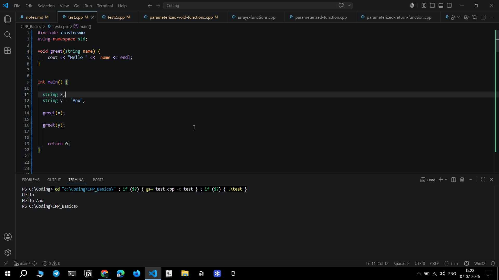
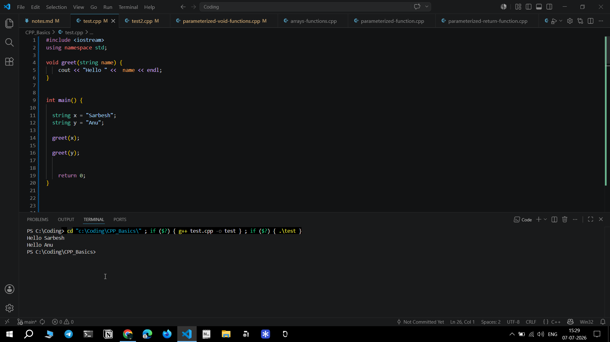
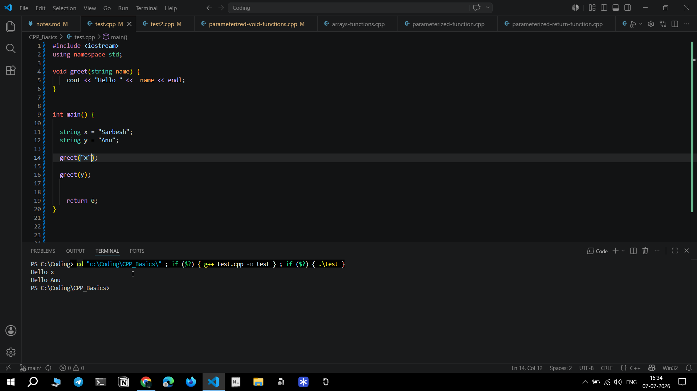


### to more understand variable string part 

code- 
```
void greet(string name) {
    cout << "Hello " << name << endl;
}

int main() {

    string person = "Rahul";

    person = "Amit";

    greet(person);

    return 0;
}
```
> Output- 
Hello Amit 

> Explanation- 

person = "Amit";
This does not create another variable. It changes the existing variable.

Where is Rahul?
Gone. It has been replaced.


> Thing to remember- 
Ealier i was thinking the varibale value will not get updated cuz of pass by value or reference...
but NO, 
Pass-by-value or reference  only starts after the function is called.


### Let's take an another example- 

code-

```
void greet(string name) {
  name = "Rohit";
  cout << name << endl;
}

int main() {

  string person = "Amit";
  greet(person);
  cout << person << endl;
}
```

> Output- 
Rohit
Amit 

>  Explanation- 

1. Before function call:
main()
person = Amit

2. After function call:
  
greet(person);
A copy is made.

main()
person = Amit

greet()
name = Amit


3. Inside function:

name = "Rohit";

Memory now becomes:- 

main()
person = Amit

greet()
name = Rohit

cout << name prints Rohit 

> The function changed name NOT person
Those are two different variables.

4. Function ends. Everything inside greet() disappears. name is destroyed.

5. Back to main()
  The only variable left is person = Amit
  cout << person;   // Amit is printed in last part of output 

6. 
greet() prints Rohit.
main() prints Amit.


### let's take a last example- 
code- 

```
void greet(string name) {
    name = "Charlie";
    cout << "Inside function: " << name << endl;
}

int main() {

  string person = "Alice";
  greet(person);
  cout << "Inside main: " << person << endl;

  return 0;
}
```

> Output- 
Inside function Charlie 
Inside main Alice 

> Insights- 
1. person contains Alice before function call
2. name receives Alice
3. inside function:  
   Inside function Charlie got printed      cuz   name = "Charlie";   changed only name 
4. inside main() after function call:
   Inside main: Alice                       cuz   person never changed 
   
   


### one intersting observation-

void greet(string name) {
    name = "Charlie";
    cout << "Inside function: " << name << endl;
}

int main() {
   string name = "Alice";
  greet(name);
  cout << "Inside main: " << name << endl;

 return 0;
}

> Output- 
Same output of previous one:

Charlie
Alice 


> Observation- 

- person varibale got changed to name variable inside main()
- so inside void and isnide main both have variable named-  name 
- but both name are not same varibales, they look identical but r not same 
- Only the local copy changed inside void greet()  it became Alice to Charlie 
- Function ends, everything inside void greet() disappears and only one variable left i.e Alice and that is printed as 2nd output inside main()
- So no colliding of varibale value or variable name happens


This is why changing one doesn't affect the other.
main()

name = Alice

↓

copy

↓

greet()

name = Alice

↓

change

↓

greet()

name = Charlie

↓

destroy

↓

main()

name = Alice

The original never changed.


> Note- 
## Local Scope in Functions

- Variables with the same name can exist in different functions.
- They do NOT refer to the same variable.
- Each function has its own local scope.
- When a function is called by value, a copy of the argument is created.
- Changing the parameter inside the function does NOT change the original variable in `main()`.
- When the function ends, only its local variables are destroyed. Variables in `main()` remain unchanged.


-------------------------------------------------------------------


**Paramerterized functions with returning functions-**

lets's take an example why we need return instead of void->

void greet(string name) {
    cout << "Hello " << name;
}
greet("Sarbesh");                      // Call

Output-> Hello Sarbesh

Can we do this? ->
int x = greet("Sarbesh");    ofc NO ❌  cuz greet() returns nothing.


- Returning Function->
```  
int add(int a, int b) {                      
    return a + b;
}
```

### Decode-
- here this function promises to return an integer 
- Suppose-> 
  add(10, 20);
- CPU enters a = 10 and b = 20 
- then return (a + b);    becomes return 30;     Functions sends 30 back to whoever called it 

Where does this 30 goes?

1. Option1:-  Print immediately 
   
  cout << add(10,20);

Execution:
add(10,20)
↓
returns 30
↓
cout << add(10,20)      // prints 30      // Output- 30 


2. Option2:- Store it 
   
   int sum = add(10,20);                       // Now sum = 30
   cout << sum;                                // Output- 30 


3. Option3:- Reuse it 
   
   int sum = add(10,20);
   cout << sum * 10;        

Output- 300   
Notice that Function code unchanged, but we did something completely different with the result. This is why returning functions are powerful.


### same example with string-
```
string getName() {
    return "Sarbesh";
}
```
cout << getName();                      // Output- Sarbesh


### Thing to Remember-
In void output happens inside function  AND  in returning output happens wherever we choose 

Void->
void add(int a, int b) {
    cout << a + b;
}


Return->
int add(int a, int b) {
    return a + b;
}

1. cout << add(10,20);

2. int result = add(10,20);

3. if(add(10,20) > 25)

all works, whenever we want output we can do 


### revising practising parameterized return function- 
prblm stat- Write a parameterized function that accepts two integers and returns their sum. Call the function from main() and print the returned value.

```
#include <iostream>
using namespace std;


int sum(int a, int b) {
  return a + b;
}

int main() {

  int res = sum(4,5) + 10;            // + 10 is not required as per prblm statement but just for concept =, it shows functions can be nested inside expressions 
  cout << res << endl;

  return 0;

}
```
> output- 19
> process- returns 9 -> 9+10 = 19

> Time complexity- 
return a + b;  takes constant time 
time complexity-  O(1)


### Challenge 1- 
```
int sumOfTwoNumbers(int a, int b)
{
    cout << "Inside function" << endl;
    return a + b;
}

int main()
{
    cout << "A" << endl;

    cout << sumOfTwoNumbers(2, 3) << endl;

    cout << "B" << endl;

    return 0;
}
```
> Output- 
A
Inside function 
5 
B

> Note-
"Inside function" is printed by the cout inside the function, while 5 is printed by the cout inside main(), right


### Challenge 2 - 
```
int add(int a, int b)
{
    cout << "Function Starts" << endl;
    return a + b;
}

int main()
{
    cout << "A" << endl;

    int x = add(2, 3);

    cout << "B" << endl;

    cout << x << endl;

    cout << "C" << endl;

    return 0;
}
```
> Output- 
A
Function starts 
B
5 
C 

> N/B:-
at exactly int x = add(2,3) function call happens 
B is printed after the function finishes 
cuz cout << x is after cout << "B"


### Challenge 3- 
```
int add(int a, int b)
{
    cout << "Inside add()" << endl;
    return a + b;
}

int main()
{
    cout << "Start" << endl;

    cout << add(2, 3) + add(4, 5) << endl;

    cout << "End" << endl;

    return 0;
}
```

> Output- 
Start 
Inside add()
Inside add ()
14 
End 

> Note- 
- 2 times function call so, add() executes twice 
- can you guess which function executed first?
  
  Ans- Ofc NO 
  cout << add(2, 3) + add(4, 5);
  the order in which the two function calls are evaluated is not guaranteed by the language.
  That means the compiler is allowed to choose.
  One compiler might do add(2,3) and then add(4,5)  -> 5 + 9
  another compiler might do add(4,5) then add(2,3)  -> 9 + 5
  both produce 14 because addition is commutative.

- If we modify the code slightly we can predict which function got executed first 
  
 int add(int a, int b)
 {
    cout << "Adding " << a << " and " << b << endl;
    return a + b;
 }

Now the output might be
Compiler A:
Start
Adding 2 and 3
Adding 4 and 5
14
End

Compiler B:
Start
Adding 4 and 5
Adding 2 and 3
14
End


### Challenge 4- 
```
int add(int a, int b)
{
    cout << "Function\n";
    return a + b;
}

int main()
{
    int x = add(2,3);

    cout << x + 10 << endl;
}
```
> Output- 
 Function
 15 


 > Remember--- 
A function can do two independent things:

1. It can print something using cout.
2. It can return a value using return.

These are completely different operations.

- cout displays output on the screen.
- return sends a value back to the caller.


## paramterized-return-function code-
// Parameterized Functions using return 
// Problem Statement- Write a function that returns addition of 2 numbers 

```
#include <iostream>
using namespace std;

int sumoftownos(int num1, int num2) {
  return num1 + num2;
}

int main() {

  int res = sumoftownos(10, 20);                         // cout << sumoftownos(10, 20);   can also be used but we used this if we need sumoftownos multiple times 

  cout << res;
    
  return 0;
}
```

### Terminology check- 

int sumOfTwoNumbers(int num1, int num2)
num1 and num2 are parameters 

sumOfTwoNumbers(10, 20);
10 and 20 are arugments 


## parameterized functions-multi-variables code-
```
int add(int a, int b) {
  return a + b;
}

int main() {

  int x = add(3, 4);
  int y = add(x, 10);

  cout << x << "\n" << y;
    
    return 0;
}
```

### Observation->
can you see that we wrote x in    ( int y = add(x, 10); )
we are passing 7 and not directly wrote 7
as x contains 7 only 


### revisiion paramterized function with multi variables code- 
Prblm stat- Write a parameterized function that returns the sum of two integers. Call the function multiple times with different values, store each returned value in separate variables, and print the results.

```
#include <iostream>
using namespace std;

int add(int a, int b) {
  return a + b;
}

int main() {

int x = add(3,4);
int y = add(x,10);
int z = add(y,x);
int s = add(add(x,y),10);

cout << x << endl << y << endl << z << endl << s;

}
```


---------------------------------------------------------


## pass by value using void code- 
```
#include <iostream>
using namespace std;

void change(int x) {
    x = 100;
    cout << x << endl;
}

int main() {
    int num = 10;

    change(num);

    cout << num;
}
```
>Output-  
100
10


### pass by value using void demo- 
prblm stat- Write a void function that accepts an integer by value, changes its value inside the function, and demonstrate that the original variable in main() remains unchanged.

```
#include <iostream>
using namespace std;


void change(int x) {

    cout << "Inside before: " << x << endl;
    x = 100;
    cout << "Inside after : " << x << endl;  
}


int main() {

    int num = 10;
    cout << "Before function: " << num << endl;
    change(num);
    cout << "After function: " << num << endl;

    return 0;
}
```
> Output- 
Before function 10 
Inside before 10 
Inside after 100
After function 10 


### Quiz of pass by value using void- 
```
void change(int x)
{
    x = x + 5;
    cout << x << endl;
}

int main()
{
    int num = 10;
    change(num);
    cout << num << endl;
}
```
> Output- 
15
10 


### pass by value using return function code- 
Prblm stat- Write a returning function that accepts an integer by value, changes its local copy, returns the modified value, and show that the original variable in main() is unaffected.

```
#include <iostream>
using namespace std;


int change(int x) {
  x = 100;
  return x;
}

int main() {

  int num = 10;

  cout << change(num) << endl;
  cout << num;

    return 0;

}
```
> Output- 
100
10 


### pass by value using return function modified code- 
Prblm stat- Write a returning function that accepts an integer by value, changes its local copy, returns the modified value, and show that the original variable in main() is unaffected.

```
#include <iostream>
using namespace std;


int change(int x) {
  x = 100;
  return x;
}

int main() {

  int num = 10;
  int result = change(num);

  cout << "Returned value: " << result << endl;
  cout << "Original value: " << num;

    return 0;

}
```
> Output- 
Returned value: 100
Original value: 10


## pass-by-value-returning-functions code-
```
#include <iostream>
using namespace std;

int change(int x) {
    x = 100;
    return x;
}

int main() {

int num = 10;                                                // Call started from here 

cout << change(num) << endl;
cout << num;

return 0;
}
```

### Observation-
Output-
100
10 

Initially:
num = 10

Call:
change(num);

Pass by value creates a copy:
num = 10
copy x = 10

Inside function:
x = 100;

Now:
copy x = 100;
num = 10;

Return:
return x;
returns 100 


Ouput:
100
10 

Returned value = 100
Original variable = 10


-------------------------------------------------


## pass by reference using void code- 
```
#include <iostream>
using namespace std;

void change(int &x) {                              // here addition of & makes it reference 
    x = 100;
}

int main() {
    int num = 10;

    change(num);

    cout << num;
}
```
Output- 100 

- No copy is created, instead x becomes another name for num ,  so both point to same variable 


### pass by reference using void lil modified code-
Prblm stat- Write a void function that accepts an integer using pass by reference. Modify the value inside the function and print the value in main() after the function call to demonstrate that changes made through the reference affect the original variable.

```
#include <iostream>
using namespace std;

void change(int &x) {
    x = 100;
    cout << x << endl;
}

int main() {

    int num = 10;
    change(num);
    
    cout << num;
}
```
> Output-
100
100

> note-
- & is not a pointer
- here,  &  means create another name for the same variable 


### pass by reference using void quiz- 
```
#include <iostream>
using namespace std;

void change(int &x)
{
    cout << "Inside before: " << x << endl;

    x = x + 20;

    cout << "Inside after: " << x << endl;
}

int main()
{
    int num = 15;

    cout << "Main before: " << num << endl;

    change(num);

    cout << "Main after: " << num << endl;

    return 0;
}
```

>Output- 
Main before 15 
inside before 15 
Inside after 35 
Main after 35


explanation of & in mnetal mode- 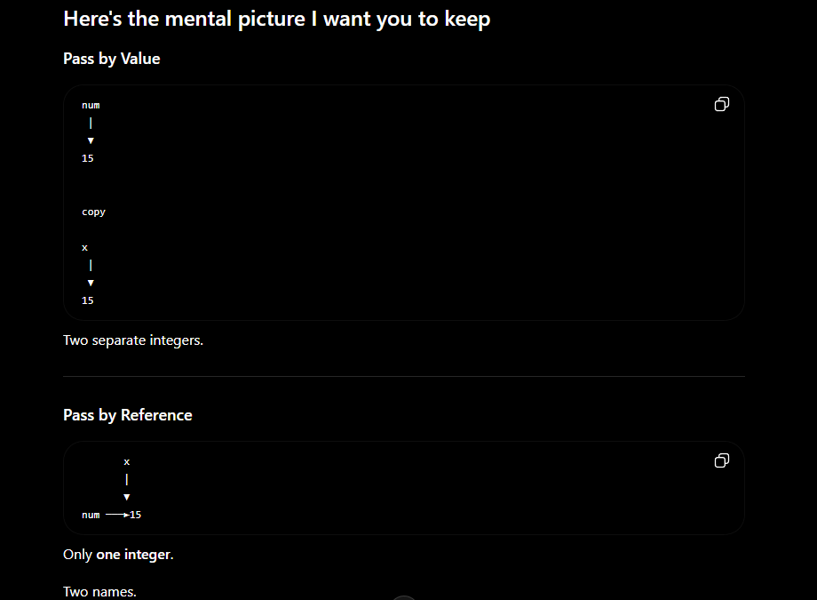


## pass-by-reference-returning-functions code-
Write a function that accepts an integer by reference, changes its value inside the function, returns the modified value, and demonstrate that the original variable in main()
is also changed.

```
#include <iostream>
using namespace std;

int change(int &x) {
    x = 100;
    return x;
}

int main() {

  int num = 10;

cout << change(num) << endl;
cout << num;

  return 0;
}
```
> Output-
100
100


### Observation-

Output- 
100
100


Initally:
num = 10 

Call:
change(num);

Reference:
x refers to num

inside function:
x = 100;

Since x and num are same varibales-
num = 100

Return:
return x;
returns 100 


Output-
100
100 

Returned value = 100
Original variable = 100


### Pass by value interesting example-


### pass by reference example-


### Same code as above but modified-
Write a function that accepts an integer by reference, changes its value inside the function, returns the modified value, and demonstrate that the original variable in main()
is also changed.

```
#include <iostream>
using namespace std;


int change(int &x) {
    x = 100;
    return x;
}


int main() {

    int num = 10;

    int updatedValue = change(num); 

    cout << "Returned value: " << updatedValue << endl;
    cout << "Return after function: " << num;

    return 0;

}
```


### Quiz- 
```
#include <iostream>
using namespace std;

int update(int &x)
{
    x = x + 5;
    return x;
}

int main()
{
    int num = 10;

    int result = update(num);

    cout << num << endl;
    cout << result << endl;
}
```
> Output-
15
15


> Mental model-

int        update       (int &x)
│             │              │
│             │              └── How the parameter is received
│             └────────────────── Function name
└──────────────────────────────── What the function returns


----------------------------------------------------------------------------------------------------------------------------------------------------------------------------------


