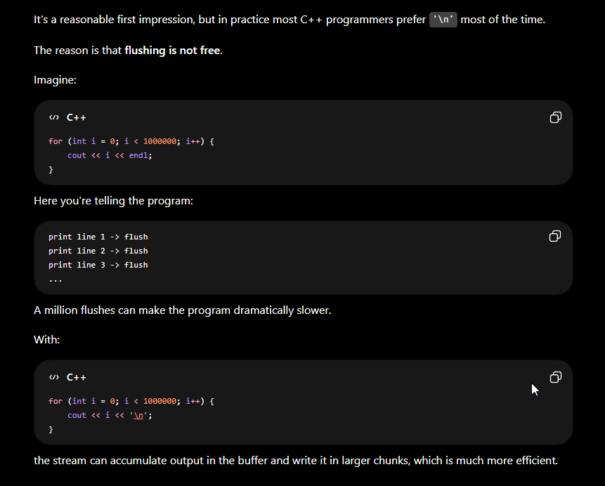
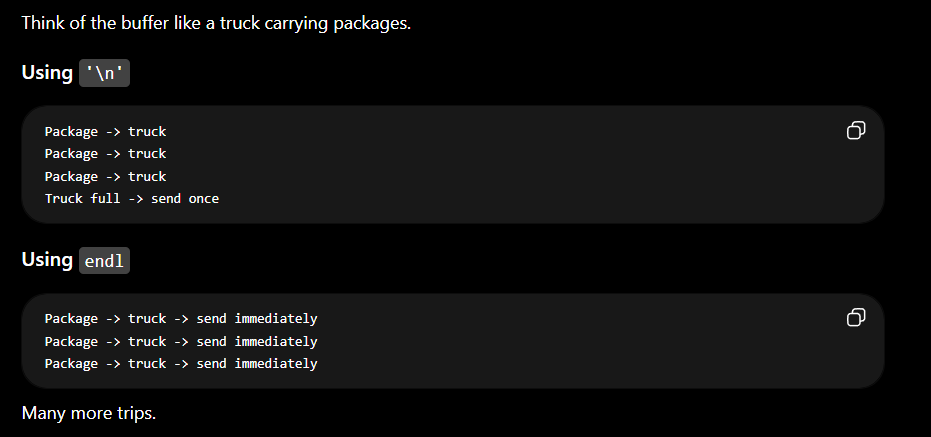
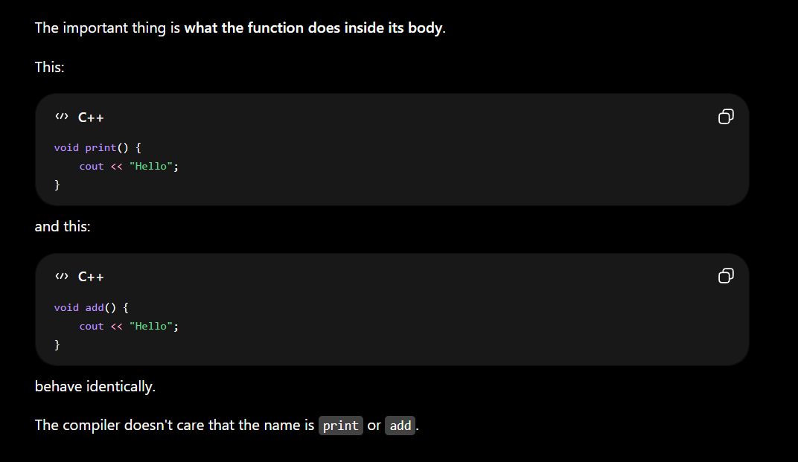
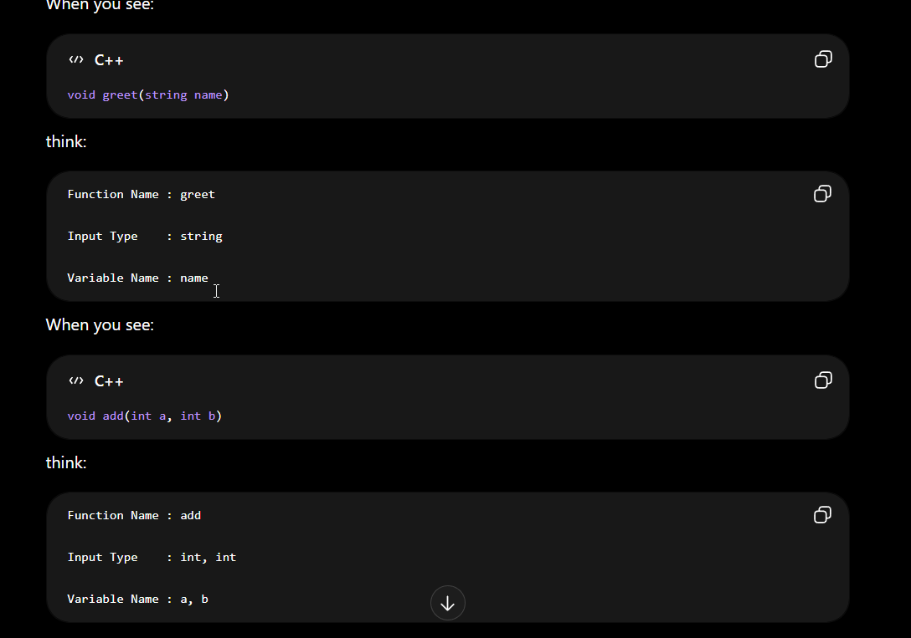
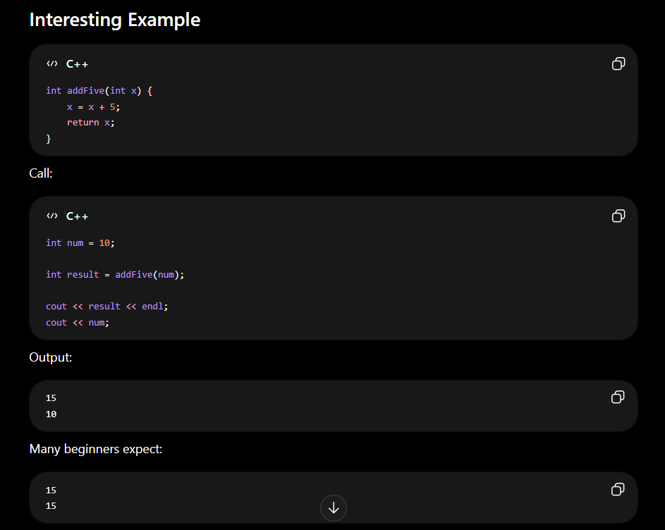
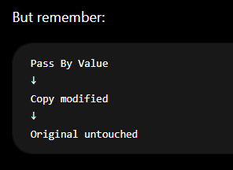
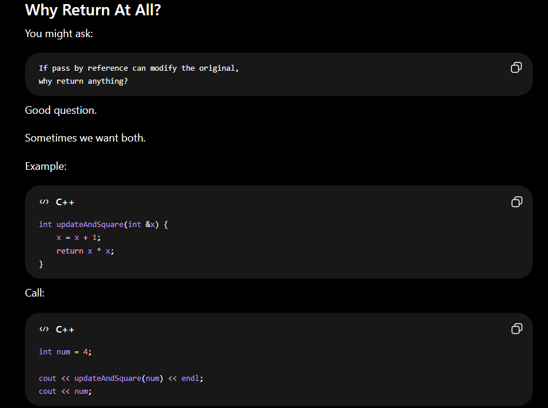
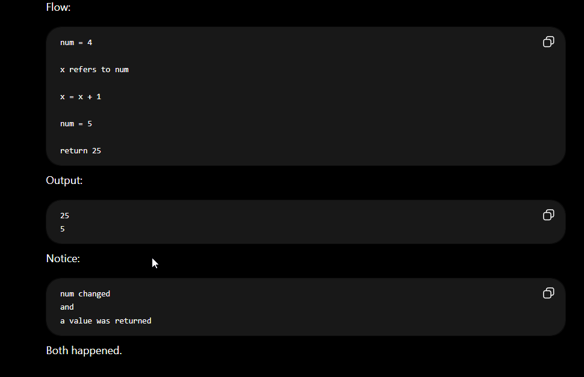

<iostream> - Rules. It defines input and output

main() - it is a function from where compiler starts reading the code. it is the Entry point of the code.

int main() - main() has to return something as output and it always returns int (integer type)

invalid in C++ (only int main is allowed)
int main() { } ✔
float main() { } ❌
double main() { } ❌
char main() { } ❌
bool main() { } ❌

void main() - a function which can do something but not need to return

using namesapce std; - it is a shortcut as we don't want to write std:: always

{} - beginning and end of main fuction or the main code which will get compiled

return 0; - tells the compiler / OS I have done writing the code and it is the end of it

endl; - executes the 1st code and takes 2nd code in new line. **NEW LINE**


--------------------------------------------------------------------------------------------------------------------------------------------------------------------------


strings are written in double quotes " "

int main() {  
 int num = 10; num is a **variable** and we can write anything like int BC = 10; and it will retuen 10 as integer
}

int main() {
int anyvariablename = 10;
cout << anyvariablename; // output will be 10
return 0;
}

---------------------------------------------------------------------------------------------------------------------------------------------------------------------------


**Integer-**

Integer range-> 10^-9 to 10^9

int main() {   
 int numInt = 10;                                                         // no double quotes in variable name
cout << "Integer is: " << numInt << endl; 
return 0; 
}                                                                                             

Output- Integer is: 10 

---------------------------------------------------------------------------------------------------------------------------------------------------------------------------

**Long-**

Long range-> 10^-12 to 10^12

#include <iostream>
using namespace std;

int main() {
int numInt = 10;
cout << numInt << endl;

    long numLong = 1000000000;
    cout << numLong;
    return 0;

}

Output-
10
1000000000

cout << INT_MAX << endl;
cout << LONG_MAX << endl;
cout << LLONG_MAX << endl;
(after including <climits>)


## Code for max- 
```
#include <iostream>
#include <climits> 

using namespace std;

int main() {

    cout << INT_MAX << endl;
    cout << LONG_MAX << endl;
    cout << LLONG_MAX << endl;

    return 0;
}
```
Output-> 
2147483647
2147483647
9223372036854775807


### Fun Fact-
1. its better to use '\n' compared to "\n" although the difference is tiny 
2. when we cout << "Hello";  the text is not printed immediately on terminal, instead it goes on temporary memory area called **Buffer**
3. Flushing means take everything currently sitting in the buffer and send it to the output device right now.
    cout << "Hello";
    cout.flush();  
4. endl is equivalent to print a newline & flushing the buffer 
5. although flush or endl is better but it is not free, mostly '\n' is used
6. 
7. buffer is like a truck carrying packages 


**LONG LONG-**

range of long long -> 10^-18 to 10^18

int main() {
int numInt = 1000000000;
cout << numInt <<endl;

    long long numLong = 1000000000000000000;
    cout << numLong;
    return 0;

}

1. Number data Types->                    int , long , long long 
2. Decimal number data types->            float , double 
3. single alphabet/letter/symbol->        char
4. multiple letters->                     string                      (string is a class under std & not data tyoe, Eg- "Sarbesh can do it!")
5. true/false->                           bool

------------------------------------------------------------------------------------------------------------------------------------------------------------------

**float & double-**

float store decimal points like 10.7
Range of float -> we can store upto 7 decimal places
Range of double float -> upto 15 decimal places

int main() {
float numFloat = 8.7;
cout << numFloat;
return 0;
}

Output- 8.7

----------------------------------------------------------------------------------------------------------------------------------------------------------------------

**char-**

char stores a single letter or symbol like a single letter of "a" or "$" or "Z"

int main() {
char ch = 'a';
cout << ch;
return 0;
}

Output- a


int main() {
char ch = 'a';
cout << "Character :" << ch << endl;
return 0;
}

Output- Character : a

-------------------------------------------------------------------------------------------------------------------------------------------------------------------

**string-**

string is a class under std and its not a data type and it stores collection of characters

#include <iostream>
using namespace namespace std;

int main() {
string str = "Sarbesh can do it!";
cout << str;

    return 0;

}

Output- Sarbesh can do it!

----------------------------------------------------------------------------------------------------------------------------------------------------------

**bool**

boolean stores only true & false
bool

----------------------------------------------------------------------------------------------------------------------------------------------------------------

Combining-

int main() {
int age = 25;
float height = 5.9;
char grade = 'A';
bool isStudent = true;
string name = "Rahul";
return 0;
}

-----------------------------------------------------------------------------------------------------------------------------------------------------------------

cin reads only one word . stops at space, newline, tab

getline() reads the entire line including spaces

char reads only first letter

-------------------------------------------------------------------------------------------------------------------------------------------------------------------------


2. **Input/Output-**

output -- ask user to put value int main()
input -- store it int num1, num2; // one data type then multiple variables
output operations -- show it as result


**tuf eg code-**
```
int main() {

    int age;

    // Output: Ask user a question
    cout << "Enter your age: ";

    // Input: Read what user types and store in 'age'
    cin >> age;

    // Output: Show the result
    cout << "Your age is: " << age;

    return 0;

}
```


**Dynamic input code-**
```
int main() {

    int num1, num2, num3, num4;                     // we are taking 4 variables here

                                                    // cout << "Enter 4 numbers: " << "\n";

    cin >> num1 >> num2 >> num3 >> num4;

    cout << num1 + num2 << endl;
    cout << num3 + num4;

    return 0;

}
```


**input-output4-** (taking 2 variables i.e bdate & num)
```
int main() {

int bdate, num;

cin >> bdate;
cin >> num;                                                 // alternatively we can write cin >> bdate >> num;

cout << "The date of birth is :" << bdate << endl;
cout << "The number is :" << num;

    return 0;

}
```


**input-output5-** (again taking 2 variables but asking user output first)
```
int main() {

int bdate;                           // Alter int bdate, num;
int num;

cout << "Enter your DoB : ";
cin >> bdate;

cout << "Enter a number : ";
cin >> num;

cout << "The DoB is : " << bdate << endl;
cout << "The number is : " << num;

    return 0;

}
```


**input-output6-** (Taking 2 data types- int & float)
```
int main() {

int bdate; float num;

cout << "Enter your DoB : "; cin >> bdate;

cout << "Enter a number : "; cin >> num;

cout << "The DoB is : " << bdate << endl << "The number is : " << num;

    return 0;
}
```

/\* Input-
Enter your DoB : 22
Enter a number : 7.85

Output-
The DoB is : 22
The number is : 7.85

// to show we dont hv to write so many lines
\*/


---------------------------------------------------------------------------------------------------------------------------------------------------------------------


3. **if/else-**

if is a conditional statement
if()

and we close braces {} when we start if and end it

if(...) it is true or the conditions are met then everything written in the curly braces will be performed.

a condition is expressed in **true** or **false**
10 > 5 → true
10 < 5 → false
a == b → true/false


**if(condition)**

**Struct of if-**
if (....) {
}


if(conditions) {
    if conditions are true then do logic/operations/print
}


**else-**
if the previous condition was false do this instead
else don't have any condition or logic

think of this as-
if (rain)
take umbrella
else
don't take umbrella


we use **else if** when there are **multiple conditions**

Marks >= 90 → Grade A
Marks >= 75 → Grade B
Marks >= 50 → Grade C
Otherwise → Fail

The compiler checks from top to bottom.
The first true condition wins.
After finding a true condition, it skips the rest.

if(x > 90) if(x > 90)
if(x > 75) else if(x > 75) --> They are not same as if's all conditions are checked and with else if checking stops when the 1st true condition arrives
if(x > 50) else if(x > 50)


**Structure-**
if(conditionals) {
operation if condition is true and checks all the next if's condition
}

else {
just operation when if is false
}

else if (conditions) {
operation and stops at 1st true condition
}


**if & else-tuff code-**

Problem statement- if the user has >1000 then cout buy a pizza or else if it is less then cout I will buy a burger 
```
int main() {
int money = 500;

    cout << "how much balance you have :";
    cin >> money;

if (money >= 1000) {
   cout << "I will buy a pizza";
}

else {
   cout << "I will buy a burger";
 }

    return 0;

}
```


**if & else code-**

Problem Statement- Given an age, print adult >= 18, or print "Teen"
```
int main() {

int age;
cout << "Enter your age: ";
cin >> age;

if (age >= 18) {
cout << "Adult";                // if we don't use else, then the program will print "Adult" for ages 18 and above, but it will not print anything for ages below 18
}

else {
cout << "Teen";
}
return 0;
}
```


**if-else-multiple-**

Problem Statement- 
// Given an age,
// if the age >= 18, print "Adult"
// if the age < 18 and >= 10, print "Teen"
// if the age < 10, print "Child"

```
int main() {

int age;
cout << "enter your age: ";
cin >> age;

if (age >= 18) {
cout << "Adult";
}

else if (age < 18 && age >= 10) {                           // in "and" "&&" operator both the condition should be true to fullfill the overall condition
cout << "Teen";                                             // or else if we want one condition can be true we will use OR " || "  operator
}

else if (age < 10) {
cout << "Child";
}

    return 0;

}
```


**if-else-multiple2-**

Problem statement-
Given the marks of a student, tell us the grade he is getting following the below rules 
 Grade A- (>=90)
 grade B- (>=70 and <90)
 Grade C- (>=50 and <70)
 Grade D- (>=35 and < 50)
 Fail-     (< 35)

```
int marks;
cout << "Enter marks :";
cin >> marks;

if (marks >= 90) {
cout << "Grade A";
}

else if (marks >= 70 && marks < 90) {
cout << "Grade B";
}

else if (marks >= 50 && marks < 70) {
cout << "Grade C";
}

else if (marks >= 35 && marks < 50) {
cout << "Grade D";
}

else {
cout << "Fail";
}

return 0;
```

----------------------------------------------------------------------------------------------------------


**switch case-**

it is another way of writing if statement but what can be possible if-else conditions

imagine we have exact values like ( 1 = Monday or 90 = Grade A )
and not marks > 90 then we need if-else
it works best when exact value matches but we need **breaks** or else program keeps flowing downwards until switch ends and that's called **Fall-through**
break; means exit the switch immediately

default means like else in if-else chain
if no case mathces- default: runs


switch() {

}


switch(variable name) {                                                // switch(day) {}  
 case 1:
break;

case 2:
break;
}


**switch-case code-**
```
int main() {

int day;
cout << "Enter the day: ";
cin >> day;

switch(day) {

    case 1:
    cout << "Monday";
    break;

    case 2:
    cout << "Tuesday";
    break;

    case 3:
    cout << "Wednesday";
    break;

    case 4:
    cout << "Thursday";
    break;

    case 5:
    cout << "Friday";
    break;

    case 6:
    cout << "weekend";
    break;

    case 7:
    cout << "weekend";
    break;

    default:
    cout<< "Invalid";

}

    return 0;

}
```


## Nested if-else->

What is Nested if-else?
A nested if-else means:
👉 an if statement inside another if statement.
So first outer condition checks, then inner condition checks.
Example:
if (condition1) {

    if (condition2) {
        // code
    }

}

Important Learning
Outer if  - Narrows down possibilities.
Inner if   -  Does more detailed checking.
That is exactly how nested conditions work.


### Nested-if-refined code-

Problem statement-
You are given three integers a, b and c
print which of these integers are largest 
if two or more integers are equal and are the largest, print any of them
the program should indicate that as well , user will input the 3 integers at runtime

```
int main() {

  int a, b, c;
  cout << "Enter your 3 numbers: ";
  cin >> a >> b >> c;


  if (a >= b) {

    if(a >= c){

      if (a == b || a == c) {
        cout << "largest number is: " << a << " & There's a tie" << endl;
      }

      else {
        cout << "largest number is: " << a << endl;
      }
    }

      else {
        cout << "largest number is: " << c << endl;
      }

  }


  else if ( b >= c) {
      
    if ( b == c) {
      cout << "largest number is: " << b << " & There's a tie" << endl;
    }

    else {
      cout << "largest number is: " << b << endl;
    }

  }


  else {
    cout << "largest number is: " << c << endl;
  }

  return 0;
  }
```


### Nested-tuf code-

Problem statement- 
You are given three integers a, b and c
print which of these integers are largest 
if two or more integers are equal and are the largest, print any of them
the program should indicate that as well
the 3 integers are 36 56 78

```
int main() {

  int a = 36;
  int b = 56;
  int c =78;

  if (a >= b) {

    if (a >= c) {
      cout << "Largest is a";
    }
    else {
      cout << "Largest is c";
    }
  }

  else if (b >= c) {
    cout << "Largest is b";
  } 

  else {
    cout << "Largest is c";
  }   


    return 0;
}
```

- So first outer condition checks, then inner condition checks.


**Visual Structure-**

if (a >= b)

    if (a >= c)
        a largest
    else
        c largest

else

    if (b >= c)
        b largest
    else
        c largest

This is the core nested if-else pattern.


Cleaner code with no ties-
if (a >= b) {

    if (a >= c)
        cout << a;
    else
        cout << c;

}
else {

    if (b >= c)
        cout << b;
    else
        cout << c;
}


--------------------------------------------------------------------------------------------------------------------------------------------------------------------


**Arrays-**

An Array is an multiple values of the same type stored in contiguous memory locations.
Arrays are containers where we can keep similar data types.

For an array of size 5-
Index: 0 1 2 3 4
Value: 10 20 30 40 50

First index = 0
Last index = n - 1

For size 5 , Last index = 4
For size 10 , Last index = 9

Accessing elements-
arr[0]
arr[2]
arr[4]

## Traversal-
for(i = 0; i < n; i++)
Think that, I am visiting every element exactly once

### Common mistake-

Suppose size is 5
arr[0]
arr[1]
arr[2]                 **arr[] -> This is Index**
arr[3]
arr[4]
This is Valid

arr[5]
This is Invalid. This is called **Out of bounds access**


num[0] -> 0 positions away from start
num[1] -> 1 position away from start
num[2] -> 2 positions away from start


First index  =  0
Last index   = size - 1
Number of elements = size


### For any array:
first index = 0
last index  = size - 1


### A concept to talk-

if we need different numbers or different variable sunder same data type what's the point of writing int num1, num2, num3...
when we write int num;  - it picks up a memeory location & whatever value u assigns it get stored in that memory
data type  variable [how many elements that array have] - 
int num[5];        - it figures out 1st,2nd,3rd,4th,5th memory address & binds them & keep it contagious - that's 5 contagious memory location 
- every memory location can store an integer & we hv 5 memory locations & all of 5 locations can store integer 

```
int main() {
int num = 5;
cout << &num;      // when we type &num it shows where the 5 is stored in memory in this case it is 0x61ff0c
return 0;          // Output- 0x61ff0c        - this is memory address where 5 is stored 
}
```

### How we declare arrays (structure)-
data type  variable [how many elements that array have] - 
int num[5];        - it figures out 1st,2nd,3rd,4th,5th memory address & binds them & keep it contagious - that's 5 contagious memory location 
- every memory location can store an integer & we hv 5 memory locations & all of 5 locations can store integer 


&  -> shows the memory location 

let's say datatype of int num = 5;
cout << &num;     -> it shows the memory location of variable num stored as integer data type 


## Arrays-print5-nos code- 

Problem Statement- Take 5 numbers from us and print them and store it in an Array 

```
int main() { 
  int num[5];

  cout << "Enter 5 numbers: ";

  for(int i = 0; i <= 4; i++) {
    cin >> num[i];                                        
    cout << num[i] << "\n";

  }
 return 0;

 }
 ```

 ### note- 
 Because arrays start from index 0
So 0 1 2 3 4 
Total = 5 elements 

Important Concept-

int num[5];    // Creates 5 boxes 
| Index | Value |
| ----- | ----- |
| 0     | ?     |
| 1     | ?     |
| 2     | ?     |
| 3     | ?     |
| 4     | ?     |

When user enter values:
it get stored inside--   cin >> num[i];        // user input gets stored in those boxes


--------------------------------------------------------------------------------------------------------------------------------------------------------------------------------


**Strings-**

we use string instead of char because char allows single letter or single symbols and string allows multiple letters 
char -> Stores one character
string -> stores a sequece of characters 

- Strings are basically  **Arrays of characters + extra functionality**

Array:
[10,20,30,40]

String:
['H','e','l','l','o']

### Both have- 
Indexing
Traversal
Length
Access by position


# cin vs getline()
cin stops reading after space 

Suppose, user enters Sarbesh Mallick as input 

Using Cin ->
```
 string name;
cin >> name;
```

Output stored in name: Sarbesh 

not entire name- Sarbesh Mallick because 
**Because cin stops reading when it encounters:**
1. space
2. tab
3. newline

So, Sarbesh Mallick
        ^
      stop here   , Mallick remains in the input buffer 


### Using getline()
```
string name;
getline(cin, name);
```
Output stored in name: Sarbesh Mallick                (full name) 


Quick Rule-
cin       -> reads one word
getline() -> reads the entire line


### We will learn string indexing 

string name = "Sarbesh";

Character:  S  a  r  b  e  s  h
Index:      0  1  2  3  4  5  6

name[0] -> S   (1st character)
name[6] -> h   (last character)


What if -> name[7] ?

for Sarbesh
- Length = 7
- Last Index = 6

So, name[7] is out of bounds and should be considered invalid access.


This is the exact same rule you learned for arrays:

Length = n
Valid indices = 0 to n-1

For "Sarbesh":

Length = 7
Valid indices = 0 to 6


### Traversing- 
It means Visit every element one by one.

For an array of [10, 20, 30, 40, 50]
Traversal means:-
Visit 10
Visit 20
Visit 30
Visit 40
Visit 50

For a string: Sarbesh 
traversal means:-
Visit 'S'
Visit 'a'
Visit 'r'
Visit 'b'
Visit 'e'
Visit 's'
Visit 'h'

when we write for(int i = 0; i < name.length(); i++)
Think of i as a finger moving across the string.       i=0 for S then i=1 for a then i=2 for r and so on.....      The loop variable is literally walking through the string.


Why do we traverse?
- Because we usually want to do something with each character.

For Array:- 10 20 30 40 50
Traversal:-
arr[0]
arr[1]
arr[2]
arr[3]
arr[4]

For String:- Sarbesh
Traversal:-
name[0]
name[1]
name[2]
name[3]
name[4]
name[5]
name[6]

### The only difference is:- 
Array -> elements are integers
String -> elements are characters


### if we have to find length-

vairable name.lenth()  
Eg:- cout << fullName.length();

Length counts every character including spaces 
For, Sarbesh Mallick:-
S a r b e s h     -> 7
(space)           -> 1
M a l l i c k     -> 7
Total:- 7 + 1 + 7 = 15

So, fullName.length() returns 15 

fullName.length()  is same as fullName.size()   and for string it does the same thing.


### Revise:-

For, Sarbesh Mallick
Length -> 15
Last Index -> 14               (Last Index = Length - 1)


### string-tuf-modified code-
```
// Probelem Statement- Store 2 strings and print it and show its length and also find the index of 3rd element 


#include <iostream>
using namespace std;

int main() {

  string firstname = "Sarbesh"; 
  string lastname = "Mallick";

  string fullname = firstname + " " + lastname;

  cout << "My fullname is: " << fullname << endl;

  cout << fullname.length() << endl;

  cout << fullname[3];
  
    
    return 0;
}
```

Output-
My fullname is: Sarbesh Mallick
15
b


### Some clarification->

- Image->


For example:
string city = "Bangalore";

Here:
city is the variable name.
"Bangalore" is the string value stored inside the variable.

Think of it like a labeled box:
Variable Name: city
Value: Bangalore

but numbers like integers dosen't need " "


int age = 22;
string name = "Sarbesh";
char grade = 'A';
Notice:
age      -> variable name  
name     -> variable name
grade    -> variable name

like in,   
string city = "Bangalore";
city is varibale and bangalore is string literal 

Single Quotes means one character ' '


### String-modified-dynamic code-   (user will input its name)

```
int main() {

  string firstname, lastname, fullname;

  cout << "Write your firstname: "; 
  cin >> firstname;                         // getline(cin, firstname);     -  we can write also this to store middlename like Sarbesh Kumar as cin ends after space

  cout << "Write your last name: ";
  cin >> lastname;

  fullname = firstname + " " + lastname;

  cout << "My fullname is: " << fullname << endl;

  cout << "Lenght of the first name is: " << firstname.length() << endl;
  cout << "Lenght of the fullname is: " << fullname.length();  

return 0;
}
```


## Common Mistakes- 

One thing to be careful about

If there was a previous cin before the getline(), then you may run into the famous:
getline() gets skipped
problem because cin leaves a newline (\n) in the input buffer.

Example:
cin >> age;
getline(cin, firstname);   // may get skipped

In such cases, you'd use:
cin.ignore();
before getline().


for my current input as getline is first there is no problem 


### getline-multiple code- 
```
int main() {

  string str1; 
  string str2;

  cout << "just hit random: ";
  getline(cin, str1);

  cout << "hit amazing ";
  getline(cin, str2);

  cout << "Life is Enjoy " << str1 << endl;
  cout << "Hit is Enjoy " << str2;
    
    return 0;
}
```

getline(cin, ?);       -   // ? is the varibale 


---------------------------------------------------------------------------------------------------------------------------------------------------------------------------


**Functions-**

Imagine you hv- 
- take 2 numbers
- Add them 
- print result 
If you need this logic 10 times, you hv to write it 10 times.
Instead, **Functions let you Write once, reuse many times**

main() is itself an function     -   int main()

- A function is a block of code that does a specific task. We write it once and call it whenever we need it.
It's like a "helper" or a "servant". We teach the servant how to make tea once, and then just order "Make Tea" anytime.
Functions keep our code clean and reusable

int main() is the entry point of cpp code 
void main() - it is a self function where it will do something but will not return anything


## Code-
```
#include <iostream>
using namespace std;
void print() {
    cout << "I am a print function" << endl;
}                                                      
int main() {
    
    return 0;                                                  // It will return nothing or print nothing , for that we need to call print() after int main()
}
```

## functions code-
```
#include <iostream>
using namespace std;

void print() {
    cout << "I am a print function" << endl;
}

int main() {

    cout << "Before print function call" << endl;

    print();                                                    // Whenver the function is called, its get a priority, it will be executed first & then reamining lines
                                                                
    cout << "After print function call" << endl;
    
    return 0;
}
```

**Output-**
Before print function call
I am a print function
After print function call


### Explanation-

void print() {
    cout << "I am a print function" << endl;                // This does not excute anything, it only tell compilers that there exists a function named print()
}                                                           // Its like a tool, tool exists but nobody is using it 


program always starts from int main()  and not from print()
1. so after int main the compiler reads "Before Print function call" and it prints that                        // Output-Before Print function call 
2. now it reads print();
3. when the cpu sees print();  -
   Pause main()
   Jump to print()
   Execute print()
   Come back / return
   Continue main()

4. inside print() cpu jumps here-
   void print() {
    cout << "I am a print function" << endl;                                                                   // Output- I am a print function
}

5. Functions ends as there is no explicit return 0; but as it is void it automatically returns when it reaches } 
6. CPU goes back to the exact place where print() 
7. Continue with main()  
   cout << "After print function call" << endl;                                                                      // Output- After print function call

8. Final Output-
   Before print function call
   I am a print function
   After print function call 

 When a function is called,
 program control jumps to that function.
 After the function finishes,
 control returns to the caller.

void means it returns nothing, its job is only to print something or doing something 
void dosen't return values to int main() , it just does it job and shows it and exits 
like void add() prints the cout but dosen't hand anything to main()


### Understanding-functions Code-
```
int add() {
    cout << 6 << endl;
    return 5;

}

int main() {

    cout << "Before print function call" << endl;

    cout << add() << endl;

    cout << "After print functionn call" << endl;
                                                                
    return 0;
}
```
cout << 6;     -  Show 6 on the screen
return 5;      - Give 5 back to the caller & caller will decide what do with it 


### Example to understand void & main-

**Void Function->**

void printName() {
    cout << "Sarbesh";
}
printName();                               // Call: printName();

Output: Sarbesh 
But what value came? -> Nothing cuz void means no return value 


**Returning Function->**

int getAge() {
    return 22;
}
cout << getAge();                   // Call
 
Output: 22


**Trick Question->**

Suppose-

void printName() {
    cout << "Sarbesh";
}

Can we do-    cout << printName();   ❌

Because, printName() returns nothing and cout needs a value to print 


**Mental Model-**
cout
↓
Screen

return
↓
Caller Function
- Different destinations.


### Inference-

The function istelf has no special power.
like print() dosent print automatically we have to write cout under that
so, we can name te function anything like void add()  or void hello()  and still print something by writing cout 
**the function name is just a label**

The important thing is what does the function does inside its body 



- Never write code after return as the function has already exited 
- in void function everything happens inside and main gets nothing, whatever u want do with void u do it inside void and just call it 
- in functions, u do the math or whatever and give it to main and main will further do processing or just print it 
  
- void -> Includes everything under it 
- function -> just do basic thing and return to main caller and the main will handle the rest 

- with void whatever we do and if we print results, it just get printed and lost we cannot usally use it later in different way 


### Let's take an example of void & return-

**My Current function with void-**

```
void twonosprint() {
    int num1, num2;
    cin >> num1 >> num2;

    cout << num1 + num2;
}
```
- Suppose user enters 10, 20 and Output will be 30 then 
- Now, 30 is printed on the screen 
- but can another part of program uses 30?   ->  NO    ->  cuz it is printed not retuned 
- twonosprint();         -  can print 30 
- twonosprint() * 10     - Can't do ❌         cuz the function returns nothing 


void function
↓
Performs an action

Returning function
↓
Produces a value

-------------------------

void function
↓
Usually performs an action
(printing, modifying data, etc.)

int function
↓
Usually computes something
and returns an answer
This isn't a strict rule, but it's a very useful beginner mental model.


- A printed value is visible to the user. A returned value is usable by the program.

  
### return-function-user code-   (User Input)
Problem Statement- write a program that accepts numbers and print summation of 2 numbers and print it using return 
```
int add(int a, int b) {

  return a + b;

}

int main() {

  int num1, num2;
  cout << "Enter two numbers: ";
  cin >> num1 >> num2;

  int result = add(num1, num2);                            // cout << "The sum is: " << add(num1, num2) << endl;    - we can call the funtion inside cout also 

  cout << result << endl;
  cout << result * 10 << endl;
    
    return 0;
}
```

### return-function-harcoded code-    (Hard Coded)
Problem Statement- write a program that accepts numbers and print summation of 2 numbers and print it using return 
```
int add(int a, int b) {
  return a + b;
}

int main() {

  int num1 = 10;
  int num2 = 20;

  int result = add(num1, num2);                 // int result = add(10, 20);       // cout << "The sum of " << num1 << " and " << num2 << " is: " << add(num1, num2) << endl;

  cout << result << endl;                          // cout << "The sum of " << num1 << " and " << num2 << " is: " << add(num1, num2) << endl;

  cout << result * 20;
    
    return 0;
}
```


--------------------------------------------------------------------------------------------------------------------------------------------------------------------------


**Paramterized functions-**

A parameterized function is a function that accepts values as input through parameters, allowing the same function to work with different data.

The Essence of a parameterized function: same function, different inputs, different outputs

Why we need parameterized function?
- becasue we don't want any modifications later, and as our input gets changed over time, the output should come in desired results 
- for example->
void greet() {
    cout << "Hello Sarbesh";
}
- Output->  Hello Sarbesh
- now tomorrow if we want Hello John, Hello Anu, Hello Cutie then?  will we create different functions for them like greetAnu() or greetCutie()  ❌
- Instead, we make the function accepts Input 

Parameters->
void greet(string name)
here:
     Function Name -> greet
     Parameter -> name
Now the function can work with any name.


## Parameterized-void-function code-
```
// paramterized functions using void 

#include <iostream>
using namespace std;

void greet(string name) {
    cout << "Hello " << name << endl;
}


int main() {

  greet("Sarbesh");
  
  greet("Anu");
 
    return 0;
}
```


### Old Code of the above- 

Old code when no endl is given inside void so the name was priniting on same line and i cleverly wrote cout << endl; in code line 1311

```
void greet(string name) {
    cout << "Hello " << name;
}


int main() {

  greet("Sarbesh");
  cout << endl;
  greet("Anu");   
  return 0;
}
```


### Code Breakdown->

void greet(string name) {
    cout << "Hello " << name << endl;
}

1. greet is just a function name 
2. we could also write void hello(string name)  or  void banana(string name)  , the compiler dosen't care
   

1. string name is a parameter 
2. **Means**- This function expects a string.
          When someone calls me,
          I'll store that string inside a variable called name.
3. think of it like an empty box, before calling name = ? ,  after calling greet("Sarbesh")  the CPU does name = "Sarbesh"
4. now the fucntion becomes   -   cout << "Hello " << "Sarbesh" << endl;
5. Output   -  Hello Sarbesh


1. why hello remains same because it is fixed and name is a variable and so it gets changed everytime
cout << "Hello " << name;


1. and coming why we choose name, we can actually choose anything over here like person or xyz 
2. like   void greet(string person) 
          cout << "Hello " << person;
3. the compiler cares about consistency 
4. like for example-

         void greet(string banana) {
         cout << "Hello " << banana;
         }
         greet("Sarbesh");

Output-   Hello Sarbesh 


### Revision-

void greet(string name)

**means:**
Function name = greet
Parameter type = string
Parameter variable = name
Whatever string is passed during function call, gets stored in name.


### Advanced Stuff->

- Current version:    
void greet(string name)
greet("Sarbesh");           // when you call

C++ creates a copy 
**Think:**
Original:
"Sarbesh"

Copy:
"Sarbesh"

Function uses the copy 


- Reference version:
void greet(string& name)     

Now no copy is created, Function directly uses the original string, Faster.

later we will use-
void greet(const string& name)

Meaning:
Don't make a copy
Use the original string
Don't allow modifications


### revising Questions-

1. 
void show(int x) {
    cout << x;
}
show(25);                     // Output- 25 


2. 
void show(int x) {                                                            -> parameter head 
    cout << x + 5;                                                            -> parameter body 
}
show(10);                     // Output- 15                                   -> show(10) is a an argument 


3. 
int add(int a, int b) {
    return a + b;
}
cout << add(2, 3);             // Output- 5


4. 
void printSalary(double salary) {
    cout << salary;
}
printSalary(12345.67);                  // Output- 12345.67


5. 
   void student(string name, int age, char grade) {
    cout << name << " "
         << age << " "
         << grade;
}
student("Sarbesh", 22, 'A');                                    // Output- Sarbesh 22 A


- Remember the Argument should match the parameter type 



- when we see:
  void greet(string name)
Function Name : greet
Input Type    : string
Variable Name : name

- when we se:
void add(int a, int b)
Function Name : add
Input Type    : int, int
Variable Name : a, b

- The pattern is always-> 
return_type function_name(parameter_type parameter_name)


-----------------------------------------------------------------


**Paramerterized functions with returning functions-**

lets's take an example why we need return instead of void->

void greet(string name) {
    cout << "Hello " << name;
}
greet("Sarbesh");                      // Call

Output-> Hello Sarbesh

Can we do this? ->
int x = greet("Sarbesh");    ofc NO ❌  cuz greet() returns nothing.


- Returning Function->
```  
int add(int a, int b) {                      
    return a + b;
}
```

### Decode-
- here this function promises to return an integer 
- Suppose-> 
  add(10, 20);
- CPU enters a = 10 and b = 20 
- then return (a + b);    becomes return 30;     Functions sends 30 back to whoever called it 

Where does this 30 goes?

1. Option1:-  Print immediately 
   
  cout << add(10,20);

Execution:
add(10,20)
↓
returns 30
↓
cout prints 30      // Output- 30 


2. Option2:- Store it 
   
   int sum = add(10,20);                       // Now sum = 30
   cout << sum;                                // Output- 30 


3. Option3:- Reuse it 
   
   int sum = add(10,20);
   cout << sum * 10;        

Output- 300   
Notice that Function code unchanged, but we did something completely different with the result. This is why returning functions are powerful.


### same example with string-
```
string getName() {
    return "Sarbesh";
}
```
cout << getName();                      // Output- Sarbesh


### Thing to Remember-
In void output happens inside function and in returning output happens wherever we choose 

Void->
void add(int a, int b) {
    cout << a + b;
}


Return->
int add(int a, int b) {
    return a + b;
}

1. cout << add(10,20);

2. int result = add(10,20);

3. if(add(10,20) > 25)

all works, whenever we want output we can do 


## paramterized-return-function code-
// Parameterized Functions using return 
// Problem Statement- Write a function that returns addition of 2 numbers 

```
#include <iostream>
using namespace std;

int sumoftownos(int num1, int num2) {
  return num1 + num2;
}

int main() {

  int res = sumoftownos(10, 20);                                // cout << sumoftownos(10, 20);   can also be used but we used this if we need sumoftownos multiple times 

  cout << res;
    
  return 0;
}
```

### Terminology check- 

int sumOfTwoNumbers(int num1, int num2)
num1 and num2 are parameters 

sumOfTwoNumbers(4, 5);
4 and 5 are arugments 


## parameterized functions-multi-variables code-
```
int add(int a, int b) {
  return a + b;
}

int main() {

  int x = add(3, 4);
  int y = add(x, 10);

  cout << x << "\n" << y;
    
    return 0;
}
```

### Observation->
can you see that we wrote x in    ( int y = add(x, 10); )
we are passing 7 and not directly wrote 7
as x contains 7 only 


## pass by value using void code- 
```
#include <iostream>
using namespace std;

void change(int x) {
    x = 100;
}

int main() {
    int num = 10;

    change(num);

    cout << num;
}
```
Output-  10 


## pass by reference using void code- 
```
#include <iostream>
using namespace std;

void change(int &x) {                              // here addition of & makes it reference 
    x = 100;
}

int main() {
    int num = 10;

    change(num);

    cout << num;
}
```
Output- 100 

- No copy is created, instead x becomes another name for num ,  so both point to same variable 


## pass-by-value-returning-functions code-
```
#include <iostream>
using namespace std;

int change(int x) {
    x = 100;
    return x;
}

int main() {

int num = 10;                                                // Call started from here 

cout << change(num) << endl;
cout << num;

return 0;
}
```

### Observation-
Output-
100
10 

Initially:
num = 10

Call:
change(num);

Pass by value creates a copy:
num = 10
copy x = 10

Inside function:
x = 100;

Now:
copy x = 100;
num = 10;

Return:
return x;
returns 100 


Ouput:
100
10 

Returned value = 100
Original variable = 10


## pass-by-reference-returning-functions code-
```
#include <iostream>
using namespace std;

int change(int &x) {
    x = 100;
    return x;
}

int main() {

  int num = 10;

cout << change(num) << endl;
cout << num;

  return 0;
}
```

### Observation-

Output- 
100
100


Initally:
num = 10 

Call:
change(num);

Reference:
x refers to num

inside function:
x = 100;

Since x and num are same varibales-
num = 100

Return:
return x;
returns 100 


Output-
100
100 

Returned value = 100
Original variable = 100


### Pass by value interesting example-




### pass by reference example-




----------------------------------------------------------------------------------------------------------------------------------------------------------------------------------


